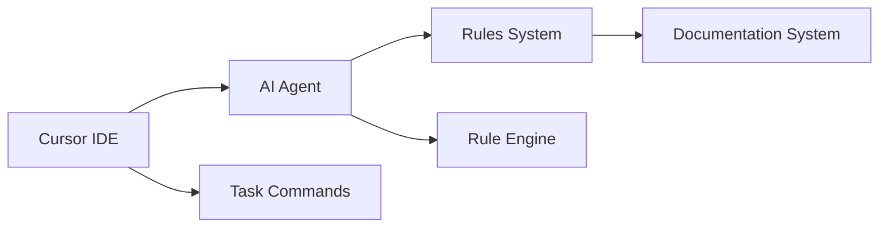

# Software Design Specification (SDS)

## 1. Introduction
- **Document purpose:** Specify system design for AI Roles Collection
- **Relation to SRS:** Implements requirements FR-1 through FR-4

## 2. System Architecture
- **Overview diagram:**

- **Main subsystems and their roles:** Task Management (workflow guidance), Rules Engine (quality enforcement), Documentation System (knowledge persistence)

## 3. Components
### 3.1 Task Commands System
- **Purpose:** Execute structured development workflows
- **Interfaces:** `/task-*` commands, outputs status/progress
- **Dependencies:** Cursor IDE command system, Git integration

### 3.2 Rules Engine
- **Purpose:** Apply coding standards and development practices
- **Interfaces:** MDC rule files, automatic application during development
- **Dependencies:** Cursor IDE extension system, language parsers

### 3.3 Documentation System
- **Purpose:** Maintain project knowledge and requirements
- **Interfaces:** Markdown files in `./documents/`, compact writing format
- **Dependencies:** File system, Git for version control

### 3.4 Verification System
- **Purpose:** Ensure project health and quality
- **Interfaces:** `./run.ts` CLI, exit codes and reports
- **Dependencies:** TypeScript compiler, linters, test runners

## 4. Data and Storage
- **Entities and attributes:** Rule (name, type, content), Task (command, workflow, status), Document (type, content, format)
- **ER diagram:** Rules → Tasks → Documents (many-to-many relationships)
- **Migration policies:** Manual updates via `/task-update-docs`

## 5. Algorithms and Logic
- **Key algorithms:** Rule application (pattern matching), Task execution (state machine), Documentation sync (diff analysis)
- **Business rules:** All rules apply automatically, tasks require explicit execution, documentation must reflect current state

## 6. Non-functional Aspects
- **Scalability:** Modular rule system supports extension
- **Fault tolerance:** Rules failures don't break development workflow
- **Security:** No sensitive data in rules, safe command execution
- **Monitoring and logging:** Command outputs, error reporting via `./run check`

## 7. Constraints and Trade-offs
- What has been simplified: Single framework instead of multiple tools
- What has been deferred to future versions: Advanced AI integration, multi-language support

## 8. Future Extensions
- Ideas and opportunities for the roadmap: Plugin system, advanced AI workflows, integration with other IDEs
