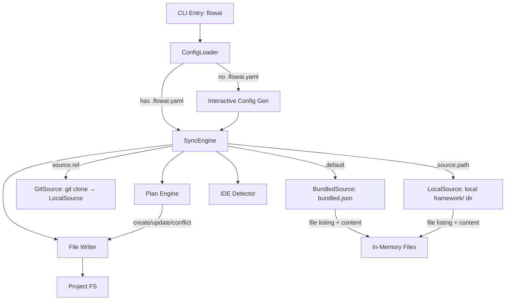

# Software Design Specification (SDS)

## 1. Introduction

- **Document purpose:** Detail the implementation and architecture of flowai.
- **Relation to SRS:** Implements requirements defined in
  `documents/requirements.md`.

## 2. System Architecture

- **Overview diagram:**
  ```mermaid
  graph TD
    Packs[framework/] -->|deno task sync-local| Claude[.claude/]
    Packs -->|flowai sync bundled.json| Users[End Users]
    Claude -->|skills, agents, hooks| IDE[Claude Code]
    IDE -->|Updates| Docs[documents/*.md]
    IDE -->|Executes| Actions[Code/Git/MCP]
    IDE -->|Updates| Claude
  ```
- **Main subsystems and their roles:**
  - **Product Framework (`framework/`):** Source of truth for end-user packs (skills, agents, hooks, scripts). Distributed via flowai.
  - **Dev Resources (`.claude/skills/`, `.claude/agents/`):** Generated by `deno task sync-local` from `framework/`. NOT tracked in git (gitignored). Auto-synced via SessionStart hook.
  - **Skills Subsystem:** Defines procedural workflows and capabilities.
  - **Agents Subsystem:** Defines specialized agent roles and prompts.
  - **Benchmark Runner:** Specialist in executing and analyzing agent acceptance tests.
  - **Documentation Subsystem:** Stores project state and memory.

## 3. Components

### 3.0 Primitive Inventory [ANC:sds:3-0]

Single-page catalog of every primitive shipped by `framework/`. The generator
pipeline `framework/atoms/*.md` + `framework/composites/*.md` +
`framework/composites.yaml` → `scripts/generate-skill-composites.ts` produces
the **generated** SKILL.md targets listed below (all gitignored — edit the
source, not the target). All other primitives are **standalone** (hand-written,
tracked in git). Detailed per-component descriptions live in §3.1 onwards.

#### Generation pipeline

- atom `commit`: `framework/atoms/commit.md` → `framework/core/commands/commit/SKILL.md` (used by 3 composites)
- atom `implement`: `framework/atoms/implement.md` → `framework/core/skills/implement/SKILL.md` (used by 2 composites)
- atom `plan`: `framework/atoms/plan.md` → `framework/core/skills/plan/SKILL.md` (used by 1 composite)
- atom `push`: `framework/atoms/push.md` → `framework/core/commands/push/SKILL.md` (used by 3 composites)
- atom `reflect-gate`: `framework/atoms/reflect-gate.md` → `framework/core/commands/reflect-gate/SKILL.md` (used by 4 composites)
- atom `review`: `framework/atoms/review.md` → `framework/core/skills/review/SKILL.md` (used by 4 composites)
- composite `review-and-commit`: `framework/composites/review-and-commit.md` → `framework/core/commands/review-and-commit/SKILL.md` (atoms: review, commit, reflect-gate)
- composite `review-commit-push`: `framework/composites/review-commit-push.md` → `framework/core/commands/review-commit-push/SKILL.md` (atoms: review, commit, push, reflect-gate)
- composite `ship`: `framework/composites/ship.md` → `framework/core/commands/ship/SKILL.md` (atoms: plan, implement, review, commit, push, reflect-gate)
- composite `ship-task`: `framework/composites/ship-task.md` → `framework/core/commands/ship-task/SKILL.md` (atoms: implement, review, commit, push, reflect-gate)

#### Commands by pack (10) — all in `core`

- `adapt` — standalone — `framework/core/commands/adapt/SKILL.md`
- `commit` — generated from atom `commit`
- `init` — standalone — `framework/core/commands/init/SKILL.md`
- `push` — generated from atom `push`
- `reflect-gate` — generated from atom `reflect-gate`
- `review-and-commit` — generated from composite `review-and-commit`
- `review-commit-push` — generated from composite `review-commit-push`
- `ship` — generated from composite `ship`
- `ship-task` — generated from composite `ship-task`
- `update` — standalone — `framework/core/commands/update/SKILL.md`

#### Skills by pack (44)

**beta (3):** `ai-ide-runner`, `delegate-to-ide` (cross-IDE bridge, see §3.17), `select-llm-model` (see §3.21) — standalone

**core (12):**

- `configure-deno-commands` — standalone
- `epic` — standalone
- `implement` — generated from atom `implement`
- `investigate` — standalone
- `maintenance` — standalone
- `plan` — generated from atom `plan`
- `reflect` — standalone
- `reflect-by-history` — standalone
- `review` — generated from atom `review`
- `setup-ai-ide-devcontainer` — standalone
- `tasks-overview` — standalone; ships `scripts/tasks_overview.py`, the template of the project-local status script
- `write-gods-tasks` — standalone; single source of the accepted task format

**deno (2):** `cli`, `deploy` — standalone

**devtools (6):** `engineer-command`, `engineer-hook`, `engineer-rule`,
`engineer-skill`, `engineer-subagent`, `write-agent-benchmarks` — all standalone

**engineering (15):** `analyze-context`, `browser-automation`, `deep-research`,
`diagnose-benchmark-failure`, `draw-mermaid-diagrams`,
`engineer-ai-ide-plugin`, `engineer-plugin-hooks`,
`engineer-plugin-marketplace`, `engineer-plugin-mcp`,
`engineer-prompts-for-instant`, `engineer-prompts-for-reasoning`,
`interactive-teaching-materials`, `write-dep`,
`write-in-informational-style`, `write-prd` — all standalone

**memex (3):** `ask`, `audit`, `save` — standalone

**typescript (2):** `setup-agent-code-style-deno`,
`setup-agent-code-style-strict` — standalone

#### Agents by pack (13) — all standalone

- `framework/core/agents/agent-adapter.md`
- `framework/core/agents/console-expert.md`
- `framework/core/agents/diff-specialist.md`
- `framework/core/agents/surface-scout.md`
- `framework/core/agents/plan-critic.md`
- `framework/core/agents/maintenance-scan-hygiene.md`
- `framework/core/agents/maintenance-scan-dependencies.md`
- `framework/core/agents/maintenance-scan-contracts.md`
- `framework/core/agents/maintenance-scan-docs.md`
- `framework/core/agents/maintenance-scan-coverage.md`
- `framework/core/agents/skill-adapter.md`
- `framework/engineering/agents/deep-research-worker.md`
- `framework/beta/agents/worker.md`

#### Summary

- Commands: 9 (3 atom-generated, 3 composite-generated, 3 standalone) — all in `core`.
- Skills: 44 (2 atom-generated in `core`, 42 standalone across 7 packs).
- Agents: 13 (all standalone — 11 in `core`, 1 in `engineering`, 1 in `beta`).
- Gitignored generated paths: 7 (5 atom targets + 2 composite targets).

### 3.1 Dev Resources (`.claude/skills/`, `.claude/agents/`) [ANC:sds:3-1]

- **Purpose:** Dev-only skills and agents for flowai development. Not distributed to users.
- **Structure:**
  - `.claude/skills/` — Framework skills (from `deno task sync-local`) + dev-only skills (bench-all, opencode-guide)
  - `.claude/agents/` — Framework agents (transformed) + dev-only agents
  - `.claude/scripts/` — Hook scripts (from `deno task sync-local`)
- **Git tracking:** `.claude/skills/`, `.claude/agents/`, `.claude/scripts/` are gitignored. Generated on-demand.
- **Auto-sync:** SessionStart hook bootstraps if missing.
- **Command:** `deno task sync-local` reads from `framework/` directly via `LocalSource` (no bundle step).

### 3.1.1 Product Packs (`framework/`) [ANC:sds:3-1-1]

- **Purpose:** Modular groups of skills, agents, hooks, and scripts for end users. Each pack is a self-contained directory.
- **Structure:**
  ```
  framework/<pack-name>/
    pack.yaml              # name, version (semver), description, scaffolds, assets (optional)
    skills/<name>/SKILL.md # skills (full installed name, e.g. commit/)
    agents/<name>.md       # agents (optional)
    hooks/<name>/          # hook.yaml + run.sh (optional)
    scripts/<name>         # utility scripts (optional)
    assets/                # shared templates (optional, e.g. AGENTS.md templates)
  ```
- **Packs:** `core` (base commands), `devtools` (skill/agent authoring), `engineering` (procedural knowledge), `deno` (Deno-specific), `typescript` (TS-specific), `memex` (long-term knowledge bank for AI agents, see §3.15), `beta` (opt-in capabilities not yet promoted to core: `select-llm-model` see §3.21, `doc-anchors-validate` hook, cross-IDE delegation relay + isolated-context subagent, see §3.17).
- **Resource discovery:** Convention over configuration — resources found by scanning subdirectories, not listed in `pack.yaml`.
- **No inter-pack dependencies:** Each pack is self-contained. Enforced by `check-pack-refs.ts` (core→non-core and non-core-A→non-core-B references are errors; any→core and intra-pack are OK).
- **Naming:** Directory names inside packs are the full installed names (e.g., `commit/`, `write-dep/`). flowai copies them as-is — no name transformation at install time.
- **Categories (by installed prefix):**
  - `commands/<name>`: User-only commands (e.g., `commit`, `review-and-commit`, `update`).
  - `skills/<name>`: Agent-auto-invocable skills (e.g., `plan`, `investigate`, `setup-agent-code-style-deno`).
- **Composition**: Skills can delegate to other skills (e.g., `init` delegates development command configuration to `configure-*-commands`). Composite SKILL.md files (`review-and-commit`, `review-commit-push`, `ship`, `ship-task`) are **gitignored build artefacts** — materialized from `framework/atoms/*.md` sources + `framework/composites/*.md` wrappers + `framework/composites.yaml` manifest by `scripts/generate-skill-composites.ts` per FR-SKILL-COMPOSE (see §3.1.1.1). Every consumer regenerates first via `--write`, so drift between source and rendered output is structurally impossible. Composite canon (no delegation, no source-skill names in description, explicit verdict-gate success/failure branches, single `<step_by_step>` per atom slot, 700-line cap) is machine-enforced inside the generator. Never hand-edit a generated SKILL.md.
- **Streamlined commit flow:** `commit` uses targeted doc sync and inline grouping. The whole reflection branch was split out on 2026-08-17 into the `reflect-gate` atom, which `review-and-commit`, `ship` and `ship-task` run as their own phase; the standalone `commit` no longer reflects at all. Reason: inside `commit` the branch had no `HAND_OFF_TO_NEXT` form, so a composite placing `commit` before another phase lost that phase — measured on `ship-task-full-cycle-success` run-1 of the 2026-08-17T09-27-52 sweep, where the reflection report ended the turn and the Push Phase never ran. The atom performs the audit INLINE and invokes no skill for it: with the `reflect` skill still reached through the Skill tool the same loss recurred in 1 run of 3 on 2026-08-19, because a sub-run ends with a report and a report reads like the end of the work. Contract: audit, self-criticism, apply the corrective edits, list them file by file, commit them as one `agent:` commit staging only the edited paths — no question, both the edit and its commit are local and reversible — then ask whether to PUSH that commit, which is the single step reaching beyond the machine. A refusal is read as a verdict on the edits themselves: the atom removes the commit and the file contents in one `git reset --hard HEAD~1`, gated on two read-only checks that hold by construction here — its commit is still `HEAD`, and `git status --porcelain` is empty because the Commit and Push phases already ran. A failed guard means the tree holds work the atom did not create, so it STOPs and changes nothing rather than reaching for a scoped restore. The push it performs is plain `git push`; `--force`, `--force-with-lease` and `--set-upstream` are refused and handed to the project's push workflow, which owns those decisions. The single question sits at the END of the phase — the position previously measured as the one where a turn ends early — so the phase is placed LAST in every composite: in `ship` and `ship-task` it runs AFTER the Push Phase, leaving one `git push` as the only work behind the stop. A declined push removes the commit and the edits together. The Conventional Commits type is MANDATORY `agent` (or `agent(<scope>)`) — it marks a change to the agent's own instructions, and classifying by the file touched instead produced `docs(agents): …` in a live run (2026-08-10), which the acceptance scenario rejects. `review-and-commit` additionally preserves task-status derivation and persistent new-shape task cleanup semantics required by FR-DOC-TASK-LIFECYCLE.
- **Terminal full-cycle composite (FR-SHIP):** `ship` (user-only command at `framework/core/commands/ship/`) drives plan → implement → review → commit → push in one invocation. Generated from five atoms: `plan` + `implement` + `review` + `commit` + `push`. Four explicit gates: variant-selection (Plan→Implement), green project check (Implement→Review), verdict gate (Review→Commit), clean-tree + branch-protection check (Commit→Push). The clean-tree gate is stated as `git status --porcelain` printing NOTHING, untracked files included, and says explicitly that Session Scope does not open it. Both halves were added on 2026-08-20 after the gate was measured passing 3 runs of 3: worded as "uncommitted edits", it did not read as covering an untracked leftover, and rule 10 (exclude pre-existing files from the commit) was taken as licence to push past one. Scope decides what to COMMIT; cleanliness decides whether to PUSH. Post-push verification: `git rev-parse @{u}` matches local `HEAD`. The Push atom forbids `--force`, gates `--force-with-lease` on per-push user authorization, and refuses divergent pushes to protected branches.
- **SDLC continuation composite (FR-SHIP-TASK):** `ship-task` (user-only command at `framework/core/commands/ship-task/`) is the post-planning counterpart of `ship`. Takes a path (or unambiguous identifier) to an already-written task file with a filled `## Solution` section and drives implement → review → commit → push. Generated from four atoms: `implement` + `review` + `commit` + `push` (no `plan` atom). Three explicit gates: green project check (Implement→Review), verdict gate (Review→Commit), clean-tree + branch-protection check (Commit→Push) — the clean-tree gate carries the same `git status --porcelain`-empty wording, untracked files included, as FR-SHIP. The composite STOPs at the start if the task file is missing or its `## Solution` is empty — it never plans. All Push-atom safety guarantees from FR-SHIP carry over verbatim.
- **Tail-of-cycle composite (FR-REVIEW-COMMIT-PUSH):** `review-commit-push` (user-only command at `framework/core/commands/review-commit-push/`) is `review-and-commit` extended to the remote. Input is the uncommitted diff already in the tree; no task file, no Plan or Implement atom. Generated from `review` + `commit` (`DIFF_SOURCE: REUSE_PRIOR_PHASE`) + `push` (`HAND_OFF_TO_NEXT`) + `reflect-gate` (`TOTAL_STOP`). Three gates with the same wording as `ship-task`: verdict gate (Review→Commit), clean-tree check with untracked files included (Commit→Push), and Push→Reflect so the push report does not end the run. STOPs at once on an empty diff.
- **`-beta` suffix ≠ `beta` pack:** the policy below keys on a primitive's **name suffix** (`<name>-beta`, an A/B-test delta against a stable `<name>`). It does NOT apply to membership in the `beta` *pack* (`framework/beta/`, opt-in capabilities). A `beta`-pack skill like `select-llm-model` ([REF:fr:model-select | FR-MODEL-SELECT]) has no stable counterpart to A/B against, so the 60-day suffix clock never starts; promotion there means moving the source dir to a stable pack (e.g. `core`/`engineering`), not a rename.
- **`-beta` lifecycle policy:** Any primitive (skill or command) whose source path ends in `-beta` MUST be either promoted (rename to its stable form, replacing the prior stable variant) or removed within **60 days** of its last functional commit. A `-beta` exists to A/B-test a delta against its stable counterpart via `deno task bench -s, --skill-override`; beyond 60 idle days the A/B comparison is no longer informative and the parallel SKILL.md becomes orphaned doc weight. `maintenance` flags any `-beta` that crosses the 60-day threshold (Documentation Health category). Coverage parity rule: each behavioral delta listed in the `-beta`'s SKILL.md (or its intro commit) MUST have ≥1 dedicated benchmark scenario — without this the A/B signal is unsubstantiated. Promotion: rename source dirs from `<name>-beta` to `<name>`, delete the prior stable, port any `-beta`-specific scenarios into the new stable benchmark dir, update SDS/SRS references. Retirement: delete the `<name>-beta` source dir, its `benchmarks/`, cache entries under `acceptance-tests/cache/<pack>/<name>-beta-*`, and any SDS/SRS mention.
- **Script independence:** Scripts in pack `scripts/` are installed into user projects without a shared `deno.json`. They MUST be runnable standalone:
  - Use `jsr:` specifiers for Deno std imports (e.g., `jsr:@std/path`), NOT bare specifiers (`@std/path`).
  - Avoid dependencies requiring import maps or `deno.json` resolution.
  - Each script header MUST include a `Run:` section with the exact `deno run` command.

#### 3.1.1.1 Generated Composite & Atomic SKILL.md — FR-SKILL-COMPOSE (`scripts/generate-skill-composites.ts`, `framework/composites.yaml`) [ANC:sds:3-1-1-1]

**Model:** SKILL.md files for atoms and composites are **gitignored build artefacts** materialized from three sources of truth in `framework/`:

- `framework/atoms/<name>.md` — single-skill body with frontmatter, wrapper sections, and exactly one `<step_by_step>` block. Supports `{{PARAM}}` placeholders and `<param-branch name="X" value="Y">…</param-branch>` blocks (stripped at render, indexed by name+value).
- `framework/composites/<name>.md` — composite wrapper with frontmatter + body containing a `{{PHASES}}` marker, optional `<inline-phase index="N">…</inline-phase>` (phase body lives in the wrapper, no atom consumed), and `<gate after="N">…</gate>` blocks for inter-phase text.
- `framework/composites.yaml` — manifest (`schema_version: 1`). `atoms:` map each atom id to its `source`, `target`, and `default_params`. `composites:` map each composite to its `target`, `wrapper`, and ordered `phases:` (each phase specifies `title` + either `atom: <id>` with optional `params:` or `inline: true`).

**Build-artefact contract:** the 8 generated SKILL.md paths are explicitly listed in `.gitignore`; `git ls-files framework/**/SKILL.md` returns nothing for generated targets. Every downstream consumer regenerates first via `deno run -A scripts/generate-skill-composites.ts --write` (idempotent):

- `scripts/task-check.ts` runs `--write` as a prerequisite before fmt/lint/tests/check-skills/check-pack-refs `--leakage`.
- `scripts/task-acceptance-tests.ts` runs `--write` before sandbox setup so `copyFrameworkToIdeDir` sees the rendered files.
- `scripts/build-plugins.ts` runs `--write` in its CLI wrapper (`if (import.meta.main)` block, not inside `buildPlugins()`) so unit tests with a fake `frameworkDir` aren't affected.
- `.github/workflows/ci.yml` Build framework tarball step runs `--write` before `tar`, so the tarball always carries the latest rendered output regardless of CI cache state.

Drift between source and rendered output is **structurally impossible** — there is no tracked rendered copy that can fall behind.

**Generator modes:**

- `--write` — render all manifest targets to disk. Also runs `checkGitignoreParity` (fails build with `missing`/`extra` diagnostics if `.gitignore` ≠ `--list-targets`).
- `--check` — syntax + parity self-test (renders into memory + checks `.gitignore` parity; does NOT compare against on-disk because fresh-clone disk is empty). Drift detection is moot under the build-artefact model.
- `--list-targets` — emit the manifest's target paths (one per line). Consumed by the parity check and any other tool wanting the authoritative list.

**Canon validator (inside the generator):** Composite SKILL.md output MUST (a) include the exact phrase "Self-contained — execute the inlined steps directly" in `description`, (b) contain a `**No skill re-entry**` rule in `<rules>` (the rule forbids re-entering a phase through a skill; a phase's own worker dispatch stays mandatory — the earlier label "No delegation" was read by the codex agent as a ban on the Review Phase's Parallel Delegation), (c) NOT name any atom from the manifest in the description (grep-checked against `framework/composites.yaml` `atoms:` keys), (d) have verdict gates with BOTH a success branch (Approve) AND a reject branch (Request Changes / Needs Discussion / Reject), and (e) stay under `SKILL_MAX_LINES` (700; atoms under `ATOM_MAX_LINES`, 1000 — both from `scripts/lib/skill-limits.ts`). Each atom source MUST contain exactly one `<step_by_step>` block. Failures point at the manifest entry and offending line.

**Bundle-leakage gate:** `framework.tar.gz` excludes generator inputs via `tar --exclude='*/atoms' --exclude='*/composites' --exclude='composites.yaml'` plus legacy `_atom.md` / `_composite.md` guards. `scripts/check-pack-refs.ts --leakage` rebuilds the tarball locally with the same flags, unpacks it, and fails with offending paths if anything leaks. End-user IDE configs see only the rendered SKILL.md.

**Token-cap exemption:** `FR-UNIVERSAL.DISCLOSURE` caps SKILL.md at 10000 tokens (`SKILL_MAX_TOKENS` in `scripts/lib/skill-limits.ts`); the cap is relaxed for composites. The exemption list is derived live from `framework/composites.yaml` via `scripts/lib/composite-list.ts`, so adding a composite to the manifest automatically exempts it without a separate hand-maintained list.

**Predecessor (deleted):** This system replaces the legacy `scripts/check-skill-sync.ts` (substring drift check) + `scripts/composite-skills.ts` (hard-coded composite list with `COMPOSITE_SKILLS` array). Both files removed; `scripts/lib/composite-list.ts` is the manifest-driven replacement.

#### 3.1.2 Script Language Policy [ANC:sds:3-1-2]

All project scripts (`framework/<pack>/skills/*/scripts/`, `framework/<pack>/commands/*/scripts/`, and root `scripts/`) use Deno/TypeScript exclusively. Python appears only in acceptance test fixtures (test project stubs).

#### 3.1.3 Skill Tool Hints (`allowed-tools`) [ANC:sds:3-1-3]

Skills MAY use the `allowed-tools` frontmatter field (experimental, per agentskills.io spec) to pre-approve tools needed for script execution. Example:

```yaml
---
name: my-skill
description: Does something
allowed-tools: Bash(deno:*)
---
```

Adoption is optional. IDEs that support `allowed-tools` will auto-approve matching tool calls; IDEs that don't will ignore the field.

### 3.2 Product Agents (in packs) [ANC:sds:3-2]

- **Purpose:** Define specialized AI subagent personas and roles for end users.
- **Structure:** `.md` files inside `framework/<pack>/agents/`. One canonical file per agent.
  Frontmatter contains universal superset of all IDE fields; body is the shared system prompt.
- **Canonical Format:** Universal frontmatter — superset of all IDE-specific fields:
  `name`, `description` (required), `tools` (string, Claude), `disallowedTools` (string, Claude),
  `readonly` (bool, Cursor), `mode` (string, OpenCode), `opencode_tools` (map, OpenCode),
  `model` (tier: `max`/`smart`/`fast`/`cheap`/`inherit`), `effort` (string, Claude),
  `maxTurns` (int, Claude; renamed `steps` for OpenCode), `background` (bool, Claude), `isolation` (string, Claude),
  `color` (string, Claude/OpenCode).
  `flowai` extracts IDE-relevant fields and resolves model tiers at install time via `transformAgent()`.
- **Model Tiers:** Abstract quality/cost intent. Resolved at install time to a PAIR — concrete model plus reasoning effort — so one tier cannot ship with two different efforts:
  - Default maps: `claude: {max: opus/max, smart: opus/high, fast: sonnet/medium, cheap: sonnet/low}`,
    `cursor: {max: slow, smart: slow, fast: fast, cheap: fast}`, `opencode: {}` (user configures).
  - Only Claude consumes the effort half; other IDEs keep the model and drop the effort, as they already do for a standalone `effort:` field.
  - A source declaring a tier MUST NOT also declare `effort:` — the tier owns that value. Tier-less primitives keep `effort:` as a standalone field.
  - User overrides via `.flowai.yaml` `models:` — a string sets the model only (built-in effort kept), an object `{model, effort}` sets the pair.
  - `inherit` or absent → both fields omitted (IDE uses parent model and effort).
  - Reverse (IDE-native → tier, cross-IDE sync) keys off the pair for Claude; a model with no matching effort degrades to the lossy model-only guess.
- **Key Agents (11 canonical files):**
  - `core/agents/console-expert.md`: Specialist in executing complex console tasks without modifying code.
  - `core/agents/diff-specialist.md`: Specialist in analyzing git diffs and planning atomic commits.
  - `core/agents/surface-scout.md`: Read-only scout enumerating the full affected surface of a change from the verbatim request (parallel implementations + consumers/producers per hit); dispatched by `plan` Step 2; output persisted verbatim in the task file's `### Affected Surface`.
  - `core/agents/plan-critic.md`: Fresh-context adversarial reviewer of a plan task file; recomputes the scout-vs-table diff itself; dispatched by `plan` Step 6 (scout block present or 2+ variants); objections surface verbatim into Step 7 triage.
  - `core/agents/skill-adapter.md`: Adapts skills to project specifics after upstream updates.
  - `core/agents/agent-adapter.md`: Adapts agent definitions to project specifics after upstream updates. Mirrors `skill-adapter` but for agent `.md` files — preserves YAML frontmatter, adapts body (system prompt).
  - `core/agents/maintenance-scan-{hygiene,dependencies,contracts,docs,coverage}.md`: 5 specialized SELF-CONTAINED read-only scan workers, one per thematic bucket (W1–W5); spawned in parallel by the `maintenance` Scan Phase (FR-MAINT-SCAN). Each declares its bucket + category set in the description, embeds its full check detail in the body (no dependency on skill files or spawn payloads), and returns leads only — no severity, no fixes, no writes (`disallowedTools: Write, Edit`). Parent consolidates + calibrates.
  - `engineering/agents/deep-research-worker.md`: Research worker for a single direction within a deep research task; spawned by `deep-research` orchestrator.
- **Distribution:** `flowai` transforms canonical agents into IDE-specific format at install time.
- **IDE frontmatter formats** (transformation rules owned by flowai, see also 3.5 Agent transformation rules):
  - **Universal (canonical):** `model` uses abstract tiers (`max`/`smart`/`fast`/`cheap`/`inherit`). Resolved by flowai at install time.
  - **Claude Code:** `name`, `description` (req), `tools`, `disallowedTools`, `model` + `effort` (both written by the tier: opus/max, opus/high, sonnet/medium, sonnet/low), `maxTurns` (int), `background` (bool), `isolation` (worktree/remote), `color`.
  - **Cursor:** `name`, `description` (req), `model` (resolved: slow/fast), `readonly` (bool).
  - **OpenCode:** `description` (req), `mode: subagent`, `model` (resolved from .flowai.yaml or omitted), `tools` (map: write/edit/bash→bool), `color`. Filename = agent name.
  - **OpenAI Codex:** Not a markdown-frontmatter format. Each agent becomes two artifacts: (a) a sidecar `<cwd>/.codex/agents/<name>.toml` with top-level `name`, `description`, `developer_instructions` (the agent body as a TOML multi-line triple-quoted string); (b) a registration block `[agents.<name>] description="..." config_file="./agents/<name>.toml"` merged into `.codex/config.toml`. Agent body markdown is transferred verbatim into `developer_instructions`. Model tier is NOT written — Codex subagents inherit the session model. See 3.5 for the `toml_merge.ts` component.

### 3.3 Project Documentation (`documents/`) [ANC:sds:3-3]

- **Purpose:** Persistent project memory across AI sessions. Single source of truth for requirements, architecture, and current plans.
- **Hierarchy:**
  1. `AGENTS.md` — project constraints and mandatory rules (root-level, read-only reference; vision/mission moved to the SRS constitution).
  2. `documents/requirements.md` (SRS) — the constitution (mission, failure modes, principles) + functional and non-functional requirements. Source of truth for "what" and "why".
  3. `documents/design.md` (SDS) — architecture and implementation details. Depends on SRS.
  4. `documents/tasks/<YYYY>/<MM>/<slug>.md` — persistent committed plans and notes in GODS format. One file per task/session.
  5. `documents/ides-difference.md` — cross-IDE capability comparison (primitives, hooks, agents, MCP). Reference for FR-HOOK-DOCS–FR-IDE-SCOPE.
  6. `documents/acceptance-testing.md` — benchmark results and analysis.
- **Rules:**
  - Traceability: code references FR-* IDs via comments (`// FR-<ID>` or `# FR-<ID>`). SRS has `[x]`/`[ ]` status without `Evidence:` paths. Validated by `scripts/check-traceability.ts` (part of `deno task check`).
  - English only (except tasks). Compressed style (no fluff, high-info words).
  - Agent reads docs at session start; outdated docs = wrong assumptions.
- **Deps:** None (plain Markdown files).

### 3.4 Acceptance Test System (`benchmarks/`, `scripts/acceptance-tests/`) [ANC:sds:3-4]

- **Purpose:** Evidence-based evaluation of AI agent skill execution quality.
- **Architecture:**
  - `deno task acceptance-tests`: Evaluates agents via evidence-based scenarios. Supports direct model selection via `-m, --model` flag, and skill override via `-s, --skill-override` for A/B testing (runs existing scenarios against a different skill name).
  - **Parallel Execution Protection**: Uses `acceptance-tests/acceptance-tests.lock` file containing the PID to prevent concurrent runs. Implements signal listeners (`SIGINT`, `SIGTERM`) and `unload` events for reliable cleanup.
  - **Transport — ACP (FR-ACCEPT.ACP, the only transport):** Agents are driven over the Agent Client Protocol (ACP — JSON-RPC 2.0 over stdio) by a single `AcpClient` (`scripts/acceptance-tests/lib/acp/client.ts`) wrapping the official `@zed-industries/agent-client-protocol` library: `initialize` → `session/new` → `session/prompt`, accumulating `session/update` assistant text into `ParsedAgentOutput`; `session/request_permission` auto-allows all tools (mocking is done out-of-band, see below). **Each turn is spoken in the IDE's own invocation form** (`nativeCommandTurn`, `acp/registry.ts`): a scenario keeps the cross-IDE `/<skill> <args>` query, and `AcpAgent` rewrites only that leading token to `<commandPrefix><skill>` before `session/prompt` — `$plan …` on codex, unchanged elsewhere. Load-bearing, not cosmetic: the `@agentclientprotocol/codex-acp` bridge parses a leading `/<name>` as one of its OWN commands before the model sees the turn — `/plan <args>` is its plan-mode toggle and is answered with `Command "/plan" requires no arguments.`, `/review <args>` runs codex's built-in review — so the first codex sweep (2026-09-02) scored 21 of 22 `plan` scenarios red without the skill ever running. The same prefix table drives the SWE-bench operator turns (FR-BENCH-SWE.IDE), so the two harnesses cannot disagree on how an IDE is addressed. `AcpAgent` (`acp/acp_agent.ts`) replaces the retired `SpawnedAgent`: it spawns the IDE's ACP server from the data-only `ACP_AGENTS` registry (`acp/registry.ts`, one row per IDE: `{ ide, launch:{command,args,env}, authMode, configDir, commandPrefix }`) under `setpgrp_exec.py` (FR-ACCEPT-GUARDS preserved), connects `AcpClient` over the child's stdio, and drives the multi-turn loop on one ACP session via `UserEmulator` (no `--resume` reparse). The four hand-written `AgentAdapter` classes + their IDE-specific `stream-json` parsers/hook-mockers were deleted; `AgentAdapter` is now a data-only profile (ide/configDir/prepareWorkspace?/calculateUsage/cliVersion) built by `createAdapter(ide)` from `ACP_AGENTS`. Claude reaches ACP via the `claude-code-acp` wrapper (Claude Agent SDK, subscription auth); Cursor (`cursor-agent --acp`), Codex (`codex acp`), and OpenCode (`opencode acp`) reach it natively.
  - **Tool mocking — PATH-shadowing (IDE-agnostic):** The static one-response-per-tool contract is preserved without IDE-specific hooks. `writeMockBin` (`acp/mock_bin.ts`) writes stub executables (one per mocked tool) into a `mockbin/` dir prepended to the spawned agent's `PATH`; each stub prints the canned reason to stdout+stderr and exits 0, so the model sees a real (canned) tool result. This replaces both the Claude `PreToolUse` hook writer and the earlier ACP permission-deny approach (which could not deliver a tool *result*, only a denial). The `PATH` prepend alone does not survive codex: it runs every command as `zsh -lc`, and `/etc/zprofile` calls `path_helper`, which rebuilds `PATH` with `/usr/bin` first and the inherited entries last — `/usr/bin/curl` won over the stub in every codex run until 2026-09-05. `writeLoginShellPathPrepend` (`acp/mock_bin.ts`) therefore also appends `export PATH="<mockbin>:$PATH"` to `<bench HOME>/.zprofile` and `.bash_profile`, which the login shell sources after the system file.
  - **Skill isolation from user-level installation — FR-ACCEPT-ISOLATION**: Claude Code's Skill tool resolves user-level (`~/.claude/skills/<name>/SKILL.md`) over project-level on name collision, so a developer's installed snapshot of `flowai-*` skills would silently shadow framework-source edits during a bench run. `prepareAcpClaudeHome(<sandbox>)` (`acp/auth.ts`, sole owner; called by `createAdapter`'s Claude `prepareWorkspace` after framework copy and before agent spawn) constructs an isolated `$HOME = <workDir>/bench-home/` (sibling of `<workDir>/sandbox/`, deliberately outside the sandbox cwd so `git status` does not see it as untracked) with an empty `.claude/skills/` and two targeted symlinks: `Library/Keychains -> ~/Library/Keychains` (default keychain search-path) and `.local/share/claude -> ~/.local/share/claude` (versioned launcher + PID lock). `.credentials.json` is deliberately omitted — letting Keychain win avoids stale-refresh-token 400s from `platform.claude.com/v1/oauth/token`. The function never reads or writes `~/.claude/skills/`. Cursor, Codex, and OpenCode have no equivalent resolution-path bug, so their profiles do not set `prepareWorkspace` and the runner passes them through unchanged. Cache invalidation is automatic: the source lives under `scripts/acceptance-tests/lib/acp/` + `adapters/`, which the cache-key `runner:` prefix already walks recursively.
  - **Cross-run isolation of the sandbox tree — FR-ACCEPT-ISOLATION**: `setupSandbox` places the sandbox in an external root via `externalSandboxRoot(workDir)` and links it back with `linkIntoRunDir` (`scripts/benchmark/sandbox_root.ts` — the same module the SWE-bench arm uses for ancestor-memory isolation), so `<run>/sandbox` and `<run>/bench-home` are symlinks and every post-run analysis path resolves unchanged. Reason: under `runs/<ts>/<scenario>/run-N/` all concurrent runs share a grandparent, and an agent that knows its own transcript path (derived from `$HOME`) reaches the neighbours with one `ls ..`. Observed 2026-08-15 in `review-and-commit-post-reflect-cleanup-commit/run-3`: reflect, searching for session history, ran `find <scenario-dir> -name '*.jsonl'`, read run-1's and run-2's transcripts, then `cd`'d into their sandboxes for `git log` — and reported "neither run-1 nor run-2 shows an `agent:` commit" as a recurring finding of the session under test. The module is listed in `cache.ts::whitelistedCrossPackageFiles`, so the result cache-key tracks it. Test: `runner_test.ts::Runner - Fixture Copying` asserts the run-dir `sandbox` is a symlink resolving outside the run dir.
  - **Filesystem isolation of the client-fs capability — FR-ACCEPT-ISOLATION**: `AcpClient` advertises `fs.readTextFile`/`fs.writeTextFile`, so the agent can delegate file access to the runner. ACP declares those paths absolute, but `claude-code-acp` passes the model's `file_path` through unchanged, so a relative one arrives relative — and `Deno.{read,write}TextFile` resolves it against the runner's cwd, the flowai repository itself. `newSession(cwd)` now records the sandbox root; `resolveSessionPath` anchors relative paths to it, and `confineWritePath` additionally rejects any write resolving outside the sandbox subtree (absolute or `../`-escaping) with an error naming both paths. Reads keep absolute paths untouched — the agent legitimately reads its bench-home config — so only the silent relative-path resolution is corrected there. Escape observed 2026-08-13 during a full `plan`/`review` sweep: a stray task file written into the real `documents/tasks/2026/08/`, and the real `.github/workflows/ci.yml`, `documents/index.md`, `scripts/check-salp.ts`, `scripts/check-skills.ts` read and rewritten by a sandboxed agent.
  - **Trace capture ahead of schema validation — FR-ACCEPT.ACP**: the client library validates every incoming `session/update` against its zod schema and answers a mismatch with `-32602 Invalid params`, dropping the notification instead of delivering it. `claude-code-acp` closes a subagent dispatch with the subagent's answer in `rawOutput` as a bare STRING, which is such a mismatch, so no dispatch result ever reached the handler: the only text captured for the call was the prompt echoed by the OPENING notification, and the trace read `-> returned: <the prompt>`. `tapIncoming` (`acp/client.ts`) pipes the stream through a `TransformStream` that hands each message to `#observeRawMessage` before the parser sees it and forwards it untouched; the observer merges `tool_call` / `tool_call_update` detail into the same `#toolCalls` map the validated handler fills, so a refused frame still reaches the trace and neither path erases the other. `flattenRawOutput` also flattens top-level content blocks, so a report reads as text rather than one escaped JSON line. Observation is wrapped in `try`/`catch` — a trace detail must never break the transport. Cost of the gap, 2026-08-13: `plan-uses-scout-findings` was diagnosed as a missing-subagent host limitation across four sweeps, on runs whose raw sessions hold the scout's full report; both of its checklist items (`scout_result_obtained`, `no_fabricated_verbatim`) were scoring the dropped frame.
  - **Codex subagent evidence from the rollouts — FR-ACCEPT.ACP**: the codex bridge (`@agentclientprotocol/codex-acp`) reports a `spawn_agent` dispatch as a tool call titled `Start subagent <task_name>` whose input holds only thread ids — never the `agent_type` — and reports the subagent's reply as nothing at all: codex hands it to the parent as a `response_item` of type `agent_message` (`Message Type: FINAL_ANSWER`) that is not a session update. `collectCodexAgentTrace` (`acp/codex_rollout.ts`) reads every `rollout-*.jsonl` under the run's `CODEX_HOME/sessions` after the turn loop and appends a `[codex-agents]` block to the trace: one `spawn_agent -> <agent_type> (task_name=…, fork_turns=…)` line per dispatch and the full text of every inter-agent message. Since codex 0.145.0 the `NEW_TASK` prompt is stored as an `encrypted_content` part next to the plaintext header; the renderer replaces it with a `[payload encrypted by codex; …not evidence of an empty or missing dispatch]` marker rather than dropping it, because an empty `Payload:` read to the judge as "the request was never passed to the scout" (`plan-affected-surface-scout`, 2026-09-06). Observed 2026-09-05: `plan-uses-scout-findings` failed `scout_result_obtained` and `no_fabricated_verbatim` on a run whose scout rollout held the whole report, and `plan-surface-non-code` failed `scout_subagent_dispatched` because the trace named the agent's ad-hoc task `surface_check` instead of `surface-scout`.
  - **Codex custom agents installed as TOML — FR-ACCEPT**: codex reads subagent roles only from `$CODEX_HOME/agents/<name>.toml` (`name`, `description`, `developer_instructions`, and a mandatory `model`), so a Markdown agent copied into `.codex/agents/` is invisible to `spawn_agent`. `installCodexAgents` (`utils.ts`, called by the runner for the codex adapter) converts every `framework/<pack>/agents/*.md` of the scenario's allowed packs with `agentToCodexToml` (`cli-internals.ts`) and pins `model` to the run's agent model. flowai-cli's own `~/.codex/agents/flowai-*.toml` files carry no `model` and fail the same way in production — tracked as an out-of-repo follow-up in `sweep-reds-follow-up`.
  - **Container isolation — abandoned, not viable for subscription auth.** A previous Docker scheme (`ce1d4c1` Jan 27 2026, removed `9e30ab7` Jan 31 2026) wrapped `bench` in `docker run -v $(pwd):/app …`. Stripped because (a) `@sigma/pty-ffi` does not work cleanly in the alpine image, AND (b) the deeper, currently-blocking reason: Claude Pro/Max subscription auth lives in macOS Keychain and is bound to the `claude` binary's code-signing identity via an "Always Allow" ACL entry. Inside a Linux container the macOS Security framework is gone, the Linux `claude` binary expects `~/.claude/.credentials.json` (which does not exist on macOS hosts), and extracting the token from Keychain into a file requires a one-time interactive system dialog ("Allow security to access Claude Code"). There is no fully unattended path. The orphan `Dockerfile` at repo root is kept for cursor-agent ad-hoc runs but is not used by the bench. Resource isolation is therefore pushed into userspace guards (see §3.4.3).
  - **Co-located Scenarios**: Scenarios are co-located with primitives — `framework/<pack>/skills/<skill>/acceptance-tests/<scenario>/mod.ts` for skills and `framework/<pack>/commands/<command>/acceptance-tests/<scenario>/mod.ts` for commands. Pack-level scenarios (e.g., AGENTS.md rules) live at `framework/<pack>/acceptance-tests/<scenario>/mod.ts` with shared fixtures.
  - **JSON Configuration**: `acceptance-tests/config.json` stores unified model presets.
  - **Direct Model Support**: If a preset is not found, the system uses the provided name as the model identifier with default settings (temperature: 0).
  - **Side-Effect Validation**: System checks sandbox state (files, git) using LLM-Judge via the Codex CLI (`codexChatCompletion` in `llm.ts`, the same transport as the benchmark's human emulator). `codex exec --output-schema <file> --output-last-message <file>` yields the validated per-item verdict object; model and reasoning effort are pinned from `config.json` (`judge.model`, `judge.effort`) and `--ignore-user-config` keeps the operator's `~/.codex/config.toml` out. No external API key required. Judge retries once on failure before marking items failed. The judge moved off `claude -p` on 2026-09-01: a `-p 4` sweep had burned the Claude subscription window in five hours (250M cache-read tokens), and every arm — agent, judge, user emulator — now runs on codex.
  - **Evidence Pipeline**: `AcpAgent` accumulates a readable per-turn transcript (user/assistant + stderr diagnostics) directly — no NDJSON `stream-json` parse/format step (the `format_logs.ts` converter was retired with the direct-CLI adapters). Evidence (user query, agent transcript, git diff/status/log, task files, generated files — the latter filtered by the `TEXT_EXTENSIONS` allowlist in `evidence.ts`, which carries web deliverables such as `.html`, `.css`, `.svg` since 2026-09-06, when `interactive-teaching-materials-basic` failed every item with "HTML contents are not provided" while the file sat in the sandbox) is written to `<runDir>/judge-evidence.md` for humans and folded into the judge's system message (`buildJudgeRequest` in `judge.ts`); `codex exec` reads the whole prompt from stdin, so large traces (~250KB) never hit argv limits. The user message to judge contains only the checklist and evaluation instruction. Evidence files persist in run directory for debugging. **Per-turn trace budgeting:** the transcript is fitted to the judge's context by `truncateTrace` (`evidence.ts`, `MAX_TRACE_LEN` 150 KB), which splits on `[turn N] >` boundaries and gives every turn an equal share, growing the share for short turns until the budget is spent; only a turn that still overflows is cut head+tail with a `...[TRUNCATED NKB]...` marker naming what went. Until 2026-08-28 `runner.ts` cut the whole trace head+tail at 40 KB, which deleted the MIDDLE of the conversation: `maintenance-tooling-relevance` showed the judge 5 of 10 turns, none of the four one-finding-at-a-time questions survived, and the scenario was diagnosed as a product defect that batched its fixes. The interviewed agent denied it and the raw session proved the agent right. **Generated-files selection:** the `GENERATED FILES` section is built by `collectGeneratedFiles` (`evidence.ts`) from git — files committed after the init hash, tracked files with uncommitted edits, and untracked files — with the IDE config dirs (`.claude`, `.codex`, `.opencode`, `.cursor`) and `node_modules` skipped, sorted by path, each file rendered head+tail by `renderFileForEvidence` at 30 KB, the section capped at 100 KB. Until 2026-09-02 it walked every text file of the sandbox in `readDir` order with a skip list written for claude only; on codex the installed framework in `.codex/` (~578 KB, part of the init commit) was rendered first and the cap fell before `documents/`, so `init-greenfield` failed `srs_sds_structure` with "the evidence does not show the contents" while the SRS on disk matched the template. Test: `evidence_test.ts`.
  - **Execution Stability**: `AcpAgent` global scenario timeout (default 15 min, `totalTimeoutMs`) + watchdog (FR-ACCEPT-GUARDS). Kills agent (`AcpAgent.kill()`, process-group SIGTERM) and proceeds to judge with the partial evidence on expiry: `composeTimeoutLogs` prepends `AcpAgent.partialLogs` to the `[GLOBAL TIMEOUT]` marker. Until 2026-08-20 the marker REPLACED the trace, so every timed-out run scored "0 tool call(s) observed" — indistinguishable from an agent that never started, and `deep-research-trigger-pos-1` was misdiagnosed as a routing failure on exactly that evidence. `detectAuthFailure` covers the neighbouring case: when the trace carries `OAuth session expired` / `Failed to authenticate` / `Invalid API key` / `Usage credits required` / `monthly spend limit` (`HARNESS_FAULT_PATTERNS`) the runner throws instead of scoring, because a CLI that never authenticated produced no behavioural result at all. The spend-limit marker was added after the sweep of 2026-08-31: the account hit its monthly limit mid-run, 27 sessions died on `[acp-error] {"acpError":"Internal error: You've hit your org's monthly spend limit …"}` before their first tool call, and the sweep was recorded as 135/225 — an outage filed as 90 product failures because one string was missing from the list. Added after an expired session on 2026-08-20 turned twelve trigger scenarios into a uniform 0/3 — negatives included — each run exiting 1 after ~12 s with an empty trace, which reads exactly like "the model answered without reaching for the skill". Remedy named in the thrown message: export the repo's OAuth token before the sweep. The guard fires ONLY on an empty tool-call trace — a scenario that asks the agent to run another IDE's CLI surfaces that child's own auth error through a tool result, which is a correct observation about the sandbox rather than a broken bench; it threw away three good runs of `delegate-to-ide-trigger-adj-1` before the count was added. `shouldInjectExitCodeCheck` covers the third case: a checklist made only of skill-invocation items is not scored on the clock, because the routing decision is in the trace long before the cap — but only when the agent actually made tool calls, so an empty trace never buys a pass. The third leak on the same path was the tool-call snapshot: `AcpAgent` took it in `run()`'s `finally`, which a timeout kill never reaches, so every timed-out run scored "0 tool call(s) observed" whatever the agent had done. `resolveToolCalls` falls back to the live client. Together these three retire the `deep-research-trigger-pos-1` misdiagnosis: its raw session shows `Skill(deep-research)` on the first move and a worker subagent running 101 turns, while the scenario had been recorded for months as an agent that never started.
  - **Skill Integration**: Both `framework/<pack>/skills/` and `framework/<pack>/commands/` are copied into the sandbox IDE config dir (pack-scoped) by `copyFrameworkToIdeDir` in `scripts/acceptance-tests/lib/utils.ts`. Commands land in the same `.{ide}/skills/` target as skills; each command's `SKILL.md` gets `disable-model-invocation: true` injected via `injectDisableModelInvocation` from `cli/src/sync.ts` (single source of truth, mirrors production sync). The flag marks the primitive as user-only — it remains discoverable but is not auto-triggered by the model. `copyFrameworkToIdeDir` also resolves abstract model tiers in each copied `SKILL.md` via `resolveSkillModel` (`cli-internals.ts`), mirroring `transformAgent`'s agent-path tier handling: `model: cheap|smart|fast|max` → the IDE-specific pair (claude: `sonnet/low | opus/high | sonnet/medium | opus/max`, writing `effort` next to `model`), `model: inherit` or an unmapped tier → both lines dropped, a concrete model id → left as-is. Without this, an abstract tier (e.g. `model: cheap` in `analyze-context`/`deep-research`) reaches the IDE CLI raw and the agent crashes with `model 'cheap' not found` the moment the skill loads.
  - **Project Instructions**: Scenarios MUST declare `agentsTemplateVars` (required field; PROJECT_NAME, TOOLING_STACK, etc.) — runner renders the single AGENTS.md from the pack-level template (`framework/<pack>/assets/AGENTS.template.md`) at runtime (single source of truth). All sections (documentation rules, development commands, planning rules, TDD flow) live in this one template. For the Claude adapter the root `CLAUDE.md` is written as a REAL FILE with the same content — it was a symlink until 2026-08-13, and the rules never reached the model that way (see the comment in `prepareSandboxFiles`). The legacy `agentsMarkdown` scenario field is not supported: a scenario cannot REPLACE the rendered template. A fixture MAY still ship its own root `AGENTS.md` / `CLAUDE.md` carrying project-specific instructions, and `composeSandboxAgentsMd` appends that text after the rendered template rather than letting the template overwrite it. Reason: for seven fixtures that file IS the scenario's premise — the memex schema being audited, the documentation rules a commit gate enforces, the four contradictions `maintenance-instruction-coherence` asserts. Until 2026-08-21 step 1.8 overwrote it silently: that sandbox held two byte-identical 23300-byte files with none of the planted contradictions, and the scenario had been red since at least 2026-08-16 for missing text deleted before the agent started. Test: `runner_agents_md_test.ts`.
  - **IDE Session Naming**: `AcpAgent` carries a `name` (`<skill>/<scenario>`) for log/evidence labelling; ACP sessions are identified by the `session/new`-returned `sessionId`.
  - **Rich Tracing**: Generates single-file `trace.html` with dashboard, per-scenario detail views, and sidebar navigation. Modular architecture: `trace.ts` (facade) → `trace-collector.ts` (data) + `trace-renderer.ts` (HTML structure) + `trace-styles.ts` (CSS/JS) + `trace-types.ts` (shared types).
  - **Unified Data UI**: All technical data (logs, scripts, prompts) use a consistent `.data-block` component with line numbers, word wrap, and smart expand/collapse.
  - **Interactive Flows**: `UserEmulator` simulates user responses via LLM for multi-turn scenarios (persona-driven).
  - **Multi-Turn Benchmarking**: `AcpAgent` + `runner.ts` reuse a single ACP session across turns (`session/prompt` on the same `sessionId`) when `UserEmulator` provides input — no `--resume` reparse.

### 3.4.1 Acceptance Test Result Cache — FR-ACCEPT-CACHE (`scripts/acceptance-tests/lib/cache.ts`) [ANC:sds:3-4-1]

- **Purpose:** Content-addressed cache of per-scenario verdicts under `acceptance-tests/cache/<pack>/<scenario-id>/<ide>.json` — LOCAL, gitignored since 2026-08-04 (see FR-ACCEPT-CACHE for the measurement that ended the tracked era). Short-circuits the agent + judge CLIs when inputs have not changed, turning `deno task acceptance-tests` into an incremental operation.
- **Interfaces:**
  - `computeCacheKey(inputs)` — pure async; sha-256 over a canonical-JSON payload. No side effects.
  - `readCache(scenario, ide)` — returns `CacheEntry | null`; treats any failure (missing file, corrupt JSON, schema mismatch) as a miss.
  - `writeCache(scenario, ide, entry)` — creates parent dirs; pretty-printed JSON.
  - `trimResultForCache(r)` — projects `BenchmarkResult` onto the committed shape; drops `logs`/`evidence`; truncates judge `reason` at `MAX_REASON_LEN = 200` with `…`.
  - `resultFromCache(scenario, entry)` — reconstructs a minimal `BenchmarkResult` for summary printing on hit.
- **Deps:** `@std/path`, `@std/fs/walk`, Web Crypto `crypto.subtle.digest("SHA-256", ...)`. No new third-party deps.
- **Data flow:**
  ```
  discoverScenarios → [per scenario]
     computeCacheKey → readCache
        hit  → resultFromCache → results[]         (skip runScenario)
        miss → runScenario → writeCache if all runs success
  ```
- **Cache-key algorithm (v2):** sha-256 of canonical JSON `{ version, scenarioId, ide, ideCliVersion, agentModel, runs, acpLibVersion, acpRegistry, inputs }` where `inputs` is a sorted map of `<prefix>:<relpath> → fileHash(path)`, built by the exported `computeCacheKeyInputs` so tests can assert membership, not just key movement. ACP is the sole transport (no transport flag — the direct path was deleted); `acpLibVersion` (`ACP_LIB_VERSION`) + `acpRegistry` (`acpRegistryFingerprint()`, a hash of the `ACP_AGENTS` table) fold the transport surface into every key so an ACP-lib bump or a registry launch-spec change invalidates stale verdicts. Prefixes: `scenario:` (scenario dir), `primitive:` (primitive dir, `acceptance-tests/` skipped), `pack.yaml:`, `agents.template:`, `runner:` (`scripts/acceptance-tests/lib/**` excluding `*_test.ts`, plus `scripts/task-acceptance-tests.ts`), `cli:` (whitelisted cross-package imports — `scripts/utils.ts`, `scripts/benchmark/sandbox_root.ts`), `config:full`. Missing files contribute nothing.
- **v1 → v2 (2026-08-22):** two defects in the `runner:` prefix. The harness's own unit tests were hashed, so editing one invalidated every slot at once — 18 of the 50 files under `lib/` are tests, and they decide nothing about how a scenario executes. And the entry-point path read `scripts/task-bench.ts`, renamed away on 2026-05-11; a missing path contributes nothing, so the file the sweep is launched from was in no key at all. Both halves are now pinned by tests in `cache_test.ts`: a `*_test.ts` marker must NOT move the key, a non-test marker under `adapters/` must, and the entry point must appear in the inputs map by name.
- **CLI integration (`scripts/task-acceptance-tests.ts`):** four flags — `--no-cache` (bypass read+write), `--refresh-cache` (skip read, force write on success), `--cache-check` (read-only, exit 1 on any miss), `--cache-with-runs` (opt-in to caching when `-n > 1`). First three are mutually exclusive. Cache is always bypassed when `scenario.skip` is set or when `-n > 1` without `--cache-with-runs`.
- **Adapter hook:** `AgentAdapter.cliVersion()` → `probeCliVersion(command, 2s timeout)` → trimmed `--version` stdout or `""` on any failure. Stable empty string keeps the key reproducible across probe failures on the same host.
- **Write policy:** write only when all N runs for a scenario return `success === true`. Failed runs never land in cache — protects against freezing broken scenarios at green.
- **Drift guard:** `cache_test.ts` parses every `*.ts` under `scripts/acceptance-tests/lib/` for imports, resolves relative paths, and asserts any import that escapes `scripts/acceptance-tests/` appears in `whitelistedCrossPackageFiles`. Catches silent staleness introduced by new cross-package dependencies.
- **Storage footprint:** One JSON file per (scenario, ide). Typical size ~1–3 KB. `logs` and `evidence` are dropped; full traces remain in `acceptance-tests/runs/`. Both directories are gitignored.
- **Lifetime:** an entry survives until any key input moves. Two of those inputs are outside the primitive being tested — the runner hash (`scripts/acceptance-tests/lib/**`) and the IDE `--version` — and each invalidates EVERY entry at once. That is why the cache is local: it pays for itself between edits on one machine and is worthless after the trip through git.

### 3.4.2 Resource Guards For Spawned Agents — FR-ACCEPT-GUARDS (`scripts/acceptance-tests/lib/process_watchdog.ts`, `system_health.ts`) [ANC:sds:3-4-2]

- **Purpose:** Prevent two host-hang failure modes observed on 2026-05-09: a fork-loop incident at 02:43 (~720 `deno test` descendants in 90 s, 4 forced reboots) and a bloat-OOM incident at 07:50 (`compressor_size = 7.18 GiB`, `compression_ratio = 14`, kernel reported "no eligible processes" to jetsam, host hung until reboot at 08:53). Container-based isolation is unavailable for subscription-auth reasons (see §3.4 "Container isolation — abandoned"); these guards are the userspace replacement.
- **Why not `setrlimit`:** the natural-looking fix — `RLIMIT_AS`/`RLIMIT_DATA` per spawn — does not work against V8-based agents on macOS. Live data: `claude` runs at RSS=95 MB but VSZ=485 GB. V8 over-reserves virtual address space for heap spaces, code cache, and isolates; any `-v` cap small enough to constrain RSS will clip the V8 reservation and crash the binary at startup. `RLIMIT_RSS` is declared in `<sys/resource.h>` but the kernel does not enforce it on macOS or Linux. `RLIMIT_NPROC` is per-user, not per-tree, and is shared with all other user processes — not safe to lower from the bench. The only kernel-enforced macOS path is `launchd` jobs with `MemoryHighWatermark`, which would require a plist per spawn and a launchctl bootstrap/bootout cycle — significantly more complex than userspace polling and was out of scope for the immediate incident response.
- **Components:**
  - **`setpgrp_exec.py`** — Python wrapper invoked between Deno and the agent CLI. Calls `os.setsid()` then `os.execvp(target, args)`. After exec the agent owns a brand-new session and process group whose PGID equals the agent's PID. Every grandchild inherits the PGID, even after re-parenting to PID 1 when an intermediate parent dies. Required because `Deno.Command` cannot itself enter a new process group; macOS does not ship the GNU `setsid` binary; and FFI to `libc setsid()` is more code than a 6-line Python wrapper. Skipped only when the test caller passes `disableWatchdog: true` to `AcpAgent` (programmatic; no env-var bypass).
  - **`process_watchdog.ts`** — per-spawned-agent poll loop. `startWatchdog(rootPid, opts)` returns `WatchdogHandle { stop, trip, isStopped }`. Every `intervalMs` (default 500):
    - Resolve PGID lazily on first tick (`getPgid(rootPid)`), falling back to `rootPid` itself when the leader has already exited (orphan-only group). The setsid contract guarantees PGID == leader PID, so the fallback is safe.
    - List process group via `pgrep -g <pgid>` — finds reparented orphans that PPID-walk misses.
    - **Fork-loop check**: `members.length - 1 > maxDescendants` (default 5) for `confirmSamples` (default 2) consecutive samples → trip.
    - **RSS-bloat check**: `readTotalRssBytes(members)` via `ps -o pid=,rss=` → sum bytes. `> maxRssBytes` (default 6 GiB) for `confirmSamples` consecutive samples → trip.
    - On trip: `tripNow()` publishes the `WatchdogTrip { cause, reason, descendants, totalRssBytes, killedPids, trippedAt }` object SYNCHRONOUSLY before awaiting the kill sequence — otherwise consumers reading `watchdog.trip()` after `child.status` resolves on SIGTERM see `null` because the kill grace period outlives the agent's exit-status resolver.
    - Kill sequence: `/bin/kill -TERM -- -<pgid>`, wait `graceMs` (cancellable via `AbortController` so `wd.stop()` lets in-flight grace exit cleanly during tests), `/bin/kill -KILL -- -<pgid>`. The negative-PID syntax targets the entire process group atomically — orphans included.
    - Programmatic-only test escape: `WatchdogOptions.disabled = true` returns a no-op handle; `AcpAgentOptions.disableWatchdog = true` ALSO skips the python wrapper. There is NO environment-variable path to bypass the watchdog — production callers cannot disable it accidentally or under agent control.
  - **History — why not PPID-walk.** The first cut of this watchdog walked descendants via `pgrep -P <root>` recursively. On 2026-05-09 12:12 a real bench scenario (`configure-deno-commands-trigger-pos-3`, since consolidated into `trigger-pos-1` on 2026-05-10) tripped the count threshold at 35 descendants; the watchdog SIGTERM'd them, but their grandchildren had already re-parented to PID 1 and were no longer descendants of root. The tree-walk reported "tree killed", the bench moved on, and the orphans kept forking in the background until the host hung and required a forced reboot. The fix is the process-group approach above — the kernel's `kill(2)` with negative PID hits all members, regardless of whether their immediate parent is still alive.
  - **`system_health.ts`** — `assertHealthy(thresholds, context)` reads `vm_stat` + `sysctl hw.memsize` + `sysctl vm.swapusage` + `sysctl vm.loadavg` + `sysctl hw.ncpu`, computes `availableBytes = free + inactive + speculative + purgeable` and `effectiveHeadroomBytes = availableBytes + freeSwap × swapDiscountFactor` (default discount 0.3 — swap is several times slower than RAM, so 1 GB of free swap counts as ~300 MB of effective headroom). Throws `SystemUnhealthyError` when headroom drops below `BENCH_MIN_HEADROOM_MB` OR load-per-CPU exceeds `BENCH_MAX_LOAD_PER_CPU`. The single-axis combined headroom replaces the earlier two-axis scheme (`BENCH_MIN_FREE_PCT` + `BENCH_MAX_SWAP_PCT`), which produced false aborts when one axis was tight but the other had ample slack. Linux returns `NEUTRAL_HEALTH` (`platform: "other"`) and never trips. There is NO escape hatch — thresholds may be tuned via env, but the gate cannot be skipped. `healthReasons(h, thresholds)` is the pure verdict both entry points share: every breached threshold as one line, empty when healthy. `waitForHealthy(thresholds, context, opts)` polls it every `DEFAULT_WAIT_INTERVAL_MS` (15 s) until the list is empty and returns the healthy snapshot; unbounded unless the caller passes `opts.timeoutMs` — both spawn paths pass `SPAWN_WAIT_TIMEOUT_MS` (12 h), and on expiry the `SystemUnhealthyError` names the elapsed wait alongside the breached thresholds — reports each unhealthy poll through `opts.onWait`, and reads once and returns off darwin. `readFn` / `sleepFn` / `nowFn` are injected by tests, so the loop is exercised without a clock.
  - **Wait-before-clock, refuse-at-spawn.** Both callers of `AcpAgent` call `waitForHealthy` BEFORE starting a clock: the acceptance runner in `runAgentWithTimeout` ahead of `performance.now()` and the 15-minute global scenario timeout, the benchmark in `runWithTimeout` (`scripts/benchmark/run.ts`) ahead of the 40-minute session budget. Transient pressure is therefore paid in wall-clock, not in a verdict or an instance. The wait CANNOT live inside `AcpAgent.run()` instead: both callers race that method against a timeout, so a wait there would be swallowed and reappear as a 124 — which is a failure verdict again, only with a different code. What remains inside `run()` is `assertHealthy`, the last resort for a host that turns in the gap between the wait and the spawn. Rationale, measured: a refusal reaches the judge as an empty trace scored as a product failure against an agent that never ran; the 2026-08-31 sweep lost four scenarios that way, and no existing detector caught them (`detectAuthFailure` / `detectHarnessFaultWarning` match auth strings only, and the short-output warning is gated on exit code 0).
  - **`acp_agent.ts` integration** (`AcpAgent.run`): `await assertHealthy(undefined, "acp <name>")` BEFORE spawn. On `SystemUnhealthyError` → log to scenario evidence, return code 75 (`EX_TEMPFAIL`), no spawn. On healthy → log snapshot to the transcript (lands in `judge-evidence.md`), spawn the ACP server under `setpgrp_exec.py`, attach `startWatchdog(child.pid, {...})`. `onTrip` callback labels the message by `trip.cause` (`[fork-loop guard]` vs `[rss-bloat guard]`) and appends to log + stderr. On finish, reads `watchdog.trip()`; if non-null, returns final exit code 137 instead of the raw client/turn code.
- **Tunables (env, all optional, threshold-only — gates cannot be disabled via env):**
  - Health: `BENCH_MIN_HEADROOM_MB` (2048), `BENCH_SWAP_DISCOUNT` (0.3), `BENCH_MAX_LOAD_PER_CPU` (4).
  - Watchdog: `BENCH_MAX_DESCENDANTS` (5), `BENCH_MAX_RSS_GB` (6), `BENCH_WATCHDOG_INTERVAL_MS` (2000), `BENCH_WATCHDOG_CONFIRM` (2).
  - Programmatic-only test bypass: `AcpAgentOptions.disableWatchdog` / `WatchdogOptions.disabled`. No env-var bypass for either guard.
- **Reaction window math:** `intervalMs × confirmSamples = 1 s` between first overshoot and kill (500 ms × 2). A pathological fork bomb on M-series silicon can produce ~200 children/s, so the worst case before kill is ~200 transient processes — well below the ~720 that triggered compressor-shortage in the original incident. Earlier default `intervalMs=2000` was tightened after a 2026-05-09 12:12 test on `configure-deno-commands-trigger-pos-3` (since consolidated into `trigger-pos-1` on 2026-05-10) where the watchdog tripped at 35 descendants but swap had already grown from 2 GiB to 6 GiB — kill in time, but spike too large.
- **Aggregate gap (open):** guards are per-`AcpAgent`. If `task-bench.ts` ever runs N scenarios in parallel, each gets its own 6 GiB cap; total can exceed the host. Sequential execution is the current default, so no aggregate accumulator exists. When concurrency is added, a runner-level `Map<rootPid, currentRssBytes>` should be threaded through and a global cap applied.
- **Deps:** `Deno.Command` (for `pgrep`, `ps`, `vm_stat`, `sysctl`). No third-party deps.

### 3.4.3 Skill Trigger Benchmarks — FR-ACCEPT.TRIGGER [ANC:sds:3-4-3]

- **Purpose:** Verify the LLM picks the correct skill (or none) for a given user query, independent of whether the skill *executes* correctly when chosen. Detects description-matching regressions: a description rewrite that makes the skill invisible (false negative) or over-broad (false positive). Pairs with execution scenarios, which assume the skill is already loaded.
- **Layout:** Co-located with each skill, parallel to existing execution scenarios:
  ```
  framework/<pack>/skills/<skill-id>/acceptance-tests/
    trigger-pos-1/mod.ts    trigger-adj-1/mod.ts    trigger-false-1/mod.ts
    <execution-scenario>/mod.ts ...
  ```
- **Naming convention:** Scenario `id` is `<skill-id>-trigger-<type>-1` where `<type>` is `pos`, `adj`, or `false`. The trailing `-1` is preserved for backward compatibility with existing trace tooling; only `n=1` is permitted (the previous 3+3+3 layout was reduced to 1+1+1 on 2026-05-10).
- **Type semantics:**
  - `trigger-pos-*` (positive): user query that naturally matches the skill's description. Skill MUST activate.
  - `trigger-adj-*` (adjacent-negative): user query for which a *different, neighboring* skill is the right match (e.g., for `investigate` an adjacent query targets `review` to scrutinize uncommitted changes). The skill under test MUST stand down.
  - `trigger-false-*` (false-use-negative): user query inside the skill's general domain but with the wrong intent — typically asking *about* the skill, asking how it works, requesting documentation on its idiom, or asking for something semantically close but explicitly excluded by the description. The skill under test MUST stand down.
- **Scenario shape:** Plain `AcceptanceTestScenario` instance with `id`, `name`, `skill`, `agentsTemplateVars`, `userQuery`, and `checklist` (1 critical item). No `setup`, no `fixturePath` (default empty sandbox is sufficient — trigger decisions happen before any project state matters).
- **Checklist phrasing (stable, judge-friendly):**
  - Positive (`expectTriggered: true`):
    - `id`: `skill_invoked`
    - `description`: "Did the agent load and act on `<skill-id>` in response to this query? Look in the trace for a `Skill` tool call or a read of the skill's `SKILL.md` for `<skill-id>`."
    - `critical`: true
  - Negative (`expectTriggered: false`):
    - `id`: `skill_not_invoked`
    - `description`: "Did the agent AVOID loading `<skill-id>`? For this query the skill is not appropriate; the agent should either invoke a different skill or respond directly without reading `<skill-id>/SKILL.md` or calling the `Skill` tool with `<skill-id>`."
    - `critical`: true
- **Deterministic scoring (no judge for trigger items):** `skill_invoked` / `skill_not_invoked` are scored from the captured tool-call trace, NOT by the LLM judge — the judge could only infer invocation from the agent's prose (the ACP transcript historically carried no tool calls), the dominant source of trigger-scenario flakiness. `AcpClient` (`acp/client.ts`) captures `tool_call` / `tool_call_update` notifications into an ordered list, exposed via `AcpAgent.getToolCalls()`. `detectSkillInvocation(toolCalls, skill)` (`scripts/acceptance-tests/lib/skill_invocation.ts`) returns true iff an explicit Skill-tool call names the skill (claude-code-acp shape: `title:"Skill"`, `kind:"other"`, `rawInput:{skill}`; alt keys `name`/`skillName` for cross-IDE robustness; exact match, no substring cross-match), or iff a shell call (`kind:"execute"`, `rawInput.command`) names `skills/<skill>/SKILL.md` explicitly — codex has no Skill tool: codex-acp lists the installed skills in the prompt and the model loads one by reading its `SKILL.md` from the shell (captured 2026-09-01, epic-trigger-pos-1: `sed -n '1,240p' <sandbox>/.codex/skills/epic/SKILL.md`); the path is delimited on both sides, so a glob sweep over every skill and a longer skill name both stay negative. A bare `fs/read_text_file` of `SKILL.md` is deliberately NOT counted: Explore subagents read `SKILL.md` files while mapping a project (delegated through the client `fs/read_text_file` capability), which is not the main agent's invocation decision and produced false positives on `skill_not_invoked` scenarios — so client-side fs reads are not captured at all, and only the explicit Skill-tool call counts. `runner.ts::judgeAndScore` filters these ids out of the judge checklist (`DETERMINISTIC_SKILL_CHECK_IDS`) and injects the deterministic verdict; for a trigger scenario whose only item is one of these, the judge is skipped entirely (zero judge cost). The checklist `description` text is retained for trace readability but no longer drives the verdict.
- **Host built-in collision (`equivalentSkills`):** the bench isolates the developer's `~/.claude/skills/` (FR-ACCEPT-ISOLATION) but cannot uninstall a skill the IDE itself ships. Claude Code's built-in `code-review` answers the same request as framework `review` and is present in every sandbox — verified absent from both `<sandbox>/.claude` and `bench-home`, so it arrives with the CLI. A 5-run series (2026-08-15, cache bypassed via `-n 5`) split `review-trigger-adj-1` 4/5: the losing run invoked `code-review` (with `ReportFindings` + 9 subagents) and did the work correctly. A scenario declares `equivalentSkills: [<name>]`; `detectSkillInvocation(toolCalls, skill, equivalents)` accepts any declared name, and `runner.ts::judgeAndScore` names the accepted alternatives in the verdict string so a pass earned by a built-in never reads as a pass earned by the skill under test. Applies to `skill_not_invoked` with the meaning inverted. This deliberately weakens the assertion from "our skill won" to "a skill of this kind ran" — declare it only where a host built-in genuinely competes, never to mask a routing defect of our own. Tests: `scripts/acceptance-tests/lib/skill_invocation_test.ts` (4 equivalence cases).
- **Cross-pack adjacency (`extraPacks`):** the runner mounts `core` + the scenario's own pack (`resolveAllowedPacks`). A trigger scenario whose correct adjacent skill lives in a third pack declares `extraPacks: [<pack>]` so that skill is actually installed — otherwise the agent has no neighbour to defer to and is forced to over-trigger the skill under test. Used by `setup-ai-ide-devcontainer-trigger-adj-1` (`["deno"]` for `deploy`) and `engineer-ai-ide-plugin-trigger-adj-1` (`["devtools"]` for `engineer-skill`).
- **Coverage enforcement:** `scripts/check-trigger-coverage.ts` walks every `framework/*/skills/*` source skill and asserts each contains exactly the 3 expected `acceptance-tests/trigger-{pos,adj,false}-1/mod.ts` files. Wired into `scripts/task-check.ts`. Failure messages list the missing/misnamed paths. Stray `trigger-{pos,adj,false}-{2,3,...}` directories are reported as misnamed.
- **WHEN-trigger description gate — FR-DESC-QUALITY:** `scripts/check-skills.ts` (`validateDescriptionWhenTrigger`, wired into `validateSkill` for `framework/` paths) fails `deno task check` when a `framework/*/skills/*` `description` lacks a recognized WHEN-trigger phrase. The allowlist lives in `WHEN_TRIGGER_PHRASES` (case-insensitive substrings: `use when`, `use this`, `use for`, `use to`, `use after`, `use proactively`, `use on`, `triggers on`, `used when`, `should be used when`, `when the user`, `when you need`). Rules: (1) `commands/` are EXEMPT — they are user-invoked via explicit `/name`, not model-discovered; `inferKind` gates the check to `kind === "skill"`. (2) The gate runs on rendered output, so composite/atom-sourced skills are covered; a failure is fixed in the atom/composite source, never the gitignored SKILL.md. (3) Presence of a phrase is a deterministic FLOOR, not a quality guarantee — specificity/third-person/anti-lazy-form quality stays reviewer-judged and is enforced product-side by engineer-skill (`validate_skill.ts` floor + SKILL.md Phase 4 self-review). Single source of truth for the phrase list is `scripts/check-skills.ts`; engineer-skill's bundled `validate_skill.ts` mirrors it by hand. Tests: `scripts/check-skills_test.ts` (WHEN-trigger cases).
  - **Production-path coupling invariant (regression guard):** all three framework-only checks (kind invariants, IDE-neutrality, FR-DESC-QUALITY) gate on `isFrameworkSkillsDir(skillsDir)`. The production caller validates `discoverSkillsDirs("framework")` output, which is RELATIVE (`framework/<pack>/skills`). A prior guard used `.includes("/framework/")` (leading slash) → false for the relative shape → every framework-only check was silently dormant in `deno task check`, while unit tests calling the inner `validate*` functions directly stayed green. Fixed by the `/(^|\/)framework\//` regex. Two regression tests prevent recurrence of this dormant-check class: (1) a **coupling test** asserts every `discoverSkillsDirs("framework")` path satisfies `isFrameworkSkillsDir` (catches discovery↔guard divergence — the relative-vs-absolute bug); (2) an **end-to-end wiring test** drives `validateAllSkills` over a framework-shaped temp tree with one deliberate violation per check and asserts each criterion fires (catches accidental removal of a check call). Both in `scripts/check-skills_test.ts`.
- **Selection guidance for authors** (also in the authoring skill):
  - `pos` query should sound like a real user — short, natural, no `/skill-name` invocation, no over-specified jargon. With N=1, the single phrasing carries the full description-match weight: pick the phrasing most likely to expose a description regression (typically the most natural / least-jargonized form a user would use).
  - `adj` query picks the *most likely confusion* skill — usually a sibling in the same pack, or a skill with overlapping vocabulary. Examples: `investigate` ↔ `review`; `plan` ↔ `epic`.
  - `false` query probes the skill's hardest no-go case. Recommended patterns: surface-vocabulary match where the actual ask is something else (e.g., a planning skill receiving "plan" in a non-software-task sense; a bug-diagnosis skill receiving a "speed up the test runner" perf request); reverse-intent traps (e.g., write *new* tests vs fix *failing* ones). **Do NOT use meta-questions about the skill itself** ("what does X cover?", "how does X work?", "when should I use X?") as false-use. Under Claude Code, installed skills are exposed as a `.claude/skills/` directory listing; a meta-query is legitimately answered by reading the skill's `SKILL.md`, so the agent will rightly load it and the judge will record activation. Treat meta-questions as positives or omit them.
- **Cost / cache:** Each scenario runs the agent once; the judge is skipped for trigger scenarios (their sole item is scored deterministically — see "Deterministic scoring" above). Trigger benchmarks compose with `FR-ACCEPT-CACHE` (no special handling). Skill-description edits invalidate exactly the affected skill's 3 scenarios; AGENTS-template edits invalidate every scenario (the template hash is in the cache key).
- **Retry:** Agent-level retry-on-result is intentionally NOT applied — re-running a "skill not invoked" until it passes would mask real description regressions. Suspected agent variance is investigated by manual re-run (`deno task acceptance-tests -f <scenario-id>`). With deterministic scoring the residual variance is the agent's own invocation choice, not judge noise.
- **History:** Original 3+3+3 layout (9 scenarios per skill) was reduced to 1+1+1 (3 per skill) on 2026-05-10; see `documents/tasks/2026/05/trigger-n1-retry.md` for rationale (no empirical justification for N=3 in the originating task; 70% of all framework acceptance tests were trigger scenarios; 24/39 skills had zero cached trigger verdicts at the time of audit, indicating the triple-redundancy was theoretical).

### 3.4a Experiments Subsystem (RELOCATED) — FR-EXP [ANC:sds:3-4a]

Relocated to [`flowai-experiments`](https://github.com/korchasa/flowai-experiments) on 2026-04-11 (provenance SHA `f311142`). That repo owns: the experiment runner/judge/noise/report/tokens libs, the `claude-md-length` variants and committed results, the `deno task experiment` CLI, and the `writeMemoryFile`/`getCleanroomEnv` adapter extensions that were experiment-only. The `AgentAdapter` contract in `flow` returns to regression acceptance-test responsibilities (no memory-file injection, no cleanroom env plumbing). `task-bench.ts` discovery was always scoped to `framework/<pack>/.../acceptance-tests/`, so no isolation logic changed.

### 3.5 Global Framework Distribution — FR-DIST (`cli/`) [ANC:sds:3-5]

- **Purpose:** Install/update flowai framework skills/agents into project-local IDE config dirs.
- **Location:** `cli/` monorepo directory. Published to JSR as `@korchasa/flowai`.
- **Pattern:** Single-command CLI. Adapter pattern for FS isolation. Bundled source (default), git clone, or local path.
- **Diagram:**

```mermaid
graph TD
    CLI[CLI Entry: flowai] --> ConfigLoader
    ConfigLoader -->|no .flowai.yaml| ConfigGenerator[Interactive Config Gen]
    ConfigLoader -->|has .flowai.yaml| SyncEngine
    ConfigGenerator --> SyncEngine
    SyncEngine -->|default| BundledSrc[BundledSource: bundled.json]
    SyncEngine -->|source.ref| GitSrc[GitSource: git clone → LocalSource]
    SyncEngine -->|source.path| LocalSrc[LocalSource: local framework/ dir]
    SyncEngine --> IdeDetector[IDE Detector]
    SyncEngine --> PlanEngine[Plan Engine]
    SyncEngine --> FileWriter[File Writer]
    BundledSrc -->|file listing + content| Memory[In-Memory Files]
    LocalSrc -->|file listing + content| Memory
    PlanEngine -->|create/update/conflict| FileWriter
    FileWriter --> FS[Project FS]
```
- **Components:** Implementation lives in the external [korchasa/flowai-cli](https://github.com/korchasa/flowai-cli) repo. Key modules (in that repo, under `src/`): `cli.ts` (entry + subcommands), `config.ts` (`.flowai.yaml` parser), `scope.ts` (project/global resolution), `config_generator.ts` (interactive + auto-detect), `source.ts` (`FrameworkSource` interface, `BundledSource`/`GitSource`/`LocalSource`/`InMemoryFrameworkSource`), `sync.ts` (orchestration), `plan.ts` (create/ok/conflict classification), `writer.ts` (filesystem writes), `transform.ts` (agent frontmatter → IDE-specific format), `toml_merge.ts` (Codex `config.toml` upsert with prefix-based ownership), `ide.ts` (IDE detection + `isInsideIDE()`), `symlinks.ts`, `version.ts`, `update.ts` (`notifyUpdateAvailable` + `runSelfUpdate`), `adapters/fs.ts` (`FsAdapter`/`DenoFsAdapter`/`InMemoryFsAdapter`); plus `scripts/bundle-framework.ts` consuming the pinned `framework-v*` tarball release.
- **Data entities:**
  - `FlowConfig`: `{ version, ides, packs, skills: {include, exclude}, agents: {include, exclude}, source? }` (`source`: git branch/local path override)
  - `SourceConfig`: `{ git?, ref?, path? }` — `ref` = branch/tag (default URL: `DEFAULT_GIT_URL`); `git` = custom repo URL (requires `ref`); `path` = local dir (mutually exclusive with `ref`)
  - `PackDefinition`: `{ name, version, description, scaffolds?: Record<skill, paths[]>, assets?: Record<template, artifactPath> }` (parsed from `pack.yaml`)
  - `HookDefinition`: `{ event, matcher?, description, timeout? }` (parsed from `hook.yaml`; timeout default: 30 PostToolUse, 600 PreToolUse). Event field is free-form (no allowlist in `emitHooks` / `HooksFileSchema`); `Stop` (turn-end) flows through the plugin-bundle generically. Effective turn-end-hook support is **Claude Code only** (empirically probed 2026-06): Codex `codex exec` fires `SessionStart` but never `Stop`, OpenCode `session.idle` is observation-only, and the `cursor-agent` CLI executes no `.cursor/hooks.json` hooks. See [REF:fr:doc-anchors.hook | FR-DOC-ANCHORS.HOOK].
  - `PlanItem`: `{ type: skill|agent|hook|script|asset, name, action: create|update|ok|conflict, sourcePath, targetPath, content }`
- **Agent transformation rules** (per IDE): See 3.2 IDE frontmatter formats.
- **Pack resolution flow:** Load config → expand `packs:` to resource lists (skills, agents, hooks, scripts from `framework/*/`) → apply `skills.include/exclude` filter → compute plan → write. `resolvePackResources()` returns `hookNames` and `scriptNames` alongside skills/agents.
- **Rich sync output:** `flowai sync` produces instruction-oriented output. Layout (top→bottom): truthful header (`flowai sync complete.` on success / `flowai sync FAILED: N error(s).` on errors, red via `cli/src/color.ts` when stdout is TTY and `NO_COLOR` unset) → `>>> ACTIONS REQUIRED` (config migration, updated/created/deleted skills with inline scaffolds, agents, hooks, assets with artifact mappings; counter shown as `N/M` when partial writes failed and failed items are hidden from the success list) → `>>> NO ACTIONS REQUIRED` summary → `>>> ERRORS (N):` block (red) listing failed writes — last so it stays visible in scrollback. Failed status is propagated by `markFailedActions()` (`cli/src/resource_index.ts`) cross-referencing `result.errors` with each section's `ResourceAction[]`. `SyncResult` includes `configMigrated`, `skillActions[]`, `agentActions[]`, `hookActions[]`, `assetActions[]`, `errors[]` (with `name`/`type` for failure attribution), and `dryRun?: boolean`.
- **Sync plan preview:** `formatSyncPlan(config, {scope, home})` (`cli/src/cli.ts`, pure string builder for testability) prints Source/IDEs/Skills/Agents block before the confirmation prompt. In global mode it appends a `Target dirs:` list of resolved user-level base dirs per IDE — including the Codex split (`~/.codex` for agents + `~/.agents` for skills) — surfacing the blast radius before any writes.
- **Dry-run (`--dry-run` / `-n`):** Compute and render the full plan without writing. Implemented via `wrapDryRun(fs)` in `cli/src/sync.ts` — a read-through `FsAdapter` that turns `writeFile`/`mkdir`/`symlink`/`remove` into no-ops, leaving every downstream write site unaware. `processPlan` short-circuits before `writeFiles` so `totalWritten` stays 0 and the renderer reports the run truthfully. Dry-run skips the spinner, the `notifyUpdateAvailable` pre-flight step, the new-config generator, and conflict prompts; exits 0 always.
- **Exit code:** `runSync` returns `number`; root command and `sync` subcommand call `Deno.exit(code)` when non-zero. `1` if `result.errors.length > 0` after a real run; `0` for any dry-run.
- **Hook installation:** Reads `hook.yaml`, generates IDE-specific config via `cli/src/hooks.ts`: Claude Code → 3-level nested `settings.json` hooks, Cursor → flat `.cursor/hooks.json`, OpenCode → generated `flowai-hooks.ts` plugin, OpenAI Codex → Claude-compatible nested `.codex/hooks.json` (events: `PreToolUse`, `PostToolUse`, `SessionStart`, `UserPromptSubmit` — same wire names as Claude; feature-gated behind the `codex_hooks` feature flag and behind the `experimental.codexHooks: true` key in `.flowai.yaml`). Event/tool name mapping per IDE (`EVENT_MAP`, `TOOL_MAP`). Manifest `.{ide}/flowai-hooks.json` tracks installed hooks for deinstallation. Merge preserves user hooks not in manifest. 1 framework hook: `skill-structure-validate` (PostToolUse, SKILL.md validation).
- **Codex subagent sync:** For `ide === "codex"`, agent-writing bypasses the standard markdown path. `syncCodexAgents(...)` in `cli/src/codex_sync.ts`: (1) reads existing `.codex/config.toml` (or starts empty); (2) writes each universal agent body as a sidecar `.codex/agents/<name>.toml` with top-level `name`, `description`, `developer_instructions = """..."""`; (3) removes legacy `flowai-*.toml` sidecars whose short-name equivalent is in the current change-set; (4) calls `mergeCodexConfig(tomlText, changes)` to upsert `[agents.<name>] description="..." config_file="./agents/<name>.toml"` blocks and strip legacy `[agents.flowai-*]` tables, preserving non-bundled TOML sections; (5) removes legacy `.codex/flowai-agents.json` manifest if present (one-shot migration from the old mechanism). Removing or renaming an agent removes both the sidecar and the `[agents.<name>]` block on next sync via bundled-name ownership plus legacy-prefix cleanup. Malformed existing `config.toml` throws with file path + underlying parse error.
- **Legacy-prefix orphan cleanup (FR-DIST.CLEAN-PREFIX):** Framework sync owns current bundled names and uses legacy `flowai-*` deletion only as a migration bridge. Invariants: (a) after writing short names, delete legacy entries whose short-name equivalent is in `keepNames` or whose old prefixed name disappeared from the bundle; (b) never delete symlinks (`entry.isSymlink`); (c) strip `ext` (`.md` for agents, `.toml` for Codex sidecars, `""` for skill dirs) before comparing against `keepNames`. For the `{ide}/skills/` dir (skills + commands share it) `keepNames = skillNames ∪ commandNames` — a single pass runs after both resources are written. User primitives and third-party skills (e.g. `paperclip`, `para-memory-files`) are untouched by construction. `runUserSync` does NOT invoke framework cleanup.
- **Script installation:** Copies to `.{ide}/scripts/` (simple file copy).
- **Naming:** Pack directory names are the final installed names (e.g., `commit`, `write-dep`). No name transformation at install time.
- **Dev-only file exclusion:** Bundle and sync exclude dev-only files from distribution: acceptance test scenarios (`/acceptance-tests/`) and test files (`_test.*`). Filtering at two levels: `bundle-framework.ts` (build time) and `readSkillFiles`/`readPackSkillFiles` in `sync.ts` (runtime).
- **Distribution:** JSR via `deno publish`. `bundled.json` generated at publish time from `framework/*/`. No build step for TS.
- **Scope + global mode (FR-DIST.GLOBAL):** `SyncScope = "project" | "global"` threaded via `cli/src/scope.ts`. CLI exposes three mutually exclusive flags on `flowai` / `flowai sync`: `--global` / `-g` (force global), `--local` / `-l` (force project), `--auto` (default). **Resolution in `--auto`** (via `resolveAutoScope(cwd, home, fs)` in `scope.ts`): (1) `<cwd>/.flowai.yaml` exists → `"project"`; (2) else `~/.flowai.yaml` exists → `"global"` (CLI logs `Using global config at ~/.flowai.yaml`); (3) both missing → `null` (caller prompts interactively, or defaults to global in `-y` mode). **Explicit flags** skip the ladder: `--global` loads/creates `~/.flowai.yaml`, `--local` loads/creates `<cwd>/.flowai.yaml`; conflicting flags (`--global` + `--local`) exit non-zero. **`migrate` subcommand** requires explicit `--global`/`--local`; no auto-resolution. **IDE guard** (`isInsideIDE()`) fires only when resolved scope is `"project"`; global scope bypasses the guard. Project mode: targets `<cwd>/.{ide}/`, scaffolds + artifact sync enabled, hooks merged into `<cwd>/.claude/settings.json`. Global mode: targets per IDE native user dir (see Components bullet for `scope.ts`), scaffolds + artifact sync SKIPPED (templates still install), hooks merged into `~/.claude/settings.json` (same manifest-based logic). `resolvePackResources()` filters by the `scope:` frontmatter field: `project-only` primitives skipped in global mode, `global-only` primitives skipped in project mode, absent = both (FR-PACKS.SCOPE).

### 3.5.1 Claude Code + Codex Plugin Marketplace — FR-DIST.MARKETPLACE (`scripts/build-plugins.ts`) [ANC:sds:3-5-1]

- **Purpose:** **Preferred** distribution channel for Claude Code + Codex: publishes flowai packs as native plugins through one generated marketplace at `korchasa/flowai-plugins`. On those IDEs the plugin install is the recommended path; the flowai CLI (3.5) stays supported there as an alternative. flowai CLI (3.5) remains the channel for Cursor / OpenCode, which have no plugin marketplace. The two channels are mutually exclusive per IDE.
- **Location:** `scripts/build-plugins.ts` (build), `scripts/validate-plugins.ts` (validator), `scripts/build-plugins_test.ts` + `scripts/validate-plugins_test.ts` (tests), `.github/workflows/ci.yml` step `Build and validate plugin marketplace` + downstream sync (publish). The `build-claude-plugins.ts` / `validate-claude-plugins.ts` compatibility wrappers were dropped once their transition release had shipped (added 0.13.x, removed after 0.14.0; nothing imported them and CI always called the new names). Output tree at `dist/claude-plugins/` is gitignored.
- **Interfaces:**
  - CLI: `deno task build-plugins [--pack core] [--framework ./framework] [--out ./dist/claude-plugins] [--marketplace-name flowai-plugins]`. Defaults: packs from `DEFAULT_PACKS`, out=`dist/claude-plugins`, marketplace-name from `DEFAULT_MARKETPLACE_NAME` constant in the build script.
  - Codex marketplace display: `.agents/plugins/marketplace.json` sets `interface.displayName` equal to the technical `marketplaceName` (`flowai-plugins` or `flowai-plugins-local`) so the Codex UI exposes the exact source namespace.
  - Check integration: `scripts/task-check.ts` runs `scripts/build-plugins.ts` and `scripts/validate-plugins.ts` as sequential prerequisites. By default the build emits the upstream marketplace name `flowai-plugins` and the check does not install or refresh plugins in the user's Claude Code / Codex; `deno task sync-plugins-local` is the explicit dogfood entry point. When `AUTO_INSTALL_PLUGINS=true` is set in env or `.env` (read via `shouldAutoInstall()`), `task-check.ts` reroutes the build to `scripts/build-plugins.ts --marketplace-name flowai-plugins-local` and appends `scripts/sync-plugins-local.ts --no-build` after the build/validate prerequisites so every healthy check auto-installs the dogfood marketplace. `sync-plugins-local --no-build` cross-checks the dist's `marketplace.json` `.name` field via the pure helper `validateCatalogMarketplaceName()` and fail-fasts if it does not equal `flowai-plugins-local` (prevents silent registration under the wrong namespace).
  - Local sync (framework developer): `scripts/sync-plugins-local.ts` rebuilds `./dist/claude-plugins` in-process via `buildPlugins({ marketplaceName: "flowai-plugins-local", … })` (composite generator runs as a pre-build step so a standalone invocation still sees fresh SKILL.md atoms), wipes the on-disk Codex payload cache at `<CODEX_HOME>/plugins/cache/flowai-plugins-local/` (resolved via the pure helper `codexCachePathFor()`) between Codex `marketplace remove` and `marketplace add` so the same-version cache cannot pin Codex to stale skill content, and removes the legacy `flowai-plugins` cache only when `shouldWipeLegacyCodexCache()` proves the old marketplace is absent or still points at this repo's local dist. A genuine upstream `flowai-plugins` Git/source registration is preserved. It re-points the `flowai-plugins-local` marketplace in each available CLI at the absolute path of that dist (`claude plugin marketplace remove flowai-plugins-local` best-effort → `claude plugin marketplace add <abs>`; same for `codex plugin marketplace …`), then for each plugin emitted by `dist/claude-plugins/.claude-plugin/marketplace.json` `planClaudeActions()` returns two lists under the dogfood namespace — `install` (idempotent re-install of EVERY emitted plugin) and `disable` (the subset the user had disabled at user scope before the re-point; `syncClaude()` runs `claude plugin disable <id> --scope user` for each right after the install). Disabled plugins are reinstalled rather than skipped because `marketplace remove` erases both the install and the `enabled: false` key from user settings, so a skipped plugin is unknown on the next run and comes back enabled. `installedBefore` is captured BEFORE `marketplace remove` so the planner doesn't lose enabled state. Codex: `planCodexPluginAdds()` returns every emitted `<name>@flowai-plugins-local` selector because `codex plugin marketplace add` only registers the source while `codex plugin add` materializes the payload cache and marks the plugin installed. `syncCodex()` captures prior dogfood `enabled` values before invoking `codex plugin add` for every emitted pack, then `reconcileCodexFlowaiPluginEntries()` strips/re-emits the dogfood tables so newcomers default to `enabled = true` and previously disabled packs return to `enabled = false`. Upstream `[plugins."<x>@flowai-plugins"]` blocks and the upstream marketplace registration are left byte-identical, enabling parallel coexistence. Refuses to mutate when the emitted set is empty (would silently wipe user state). CLI probes: `<cmd> --version` for presence, `codex plugin marketplace --help` for subcommand support on Codex; either failure → warn + skip without abort. Pure functions `planClaudeActions`, `planCodexPluginAdds`, `parseAndStripFlowaiTables`, `reconcileCodexFlowaiPluginEntries`, `readMarketplacePluginNames`, `parseArgs`, `autoInstallEnabled`, `validateCatalogMarketplaceName`, `codexCachePathFor`, `shouldWipeLegacyCodexCache` are unit-tested.
  - CI: steps inside the existing `release` job, gated on the same `should_release == 'true'` condition that produces `framework-v*` tags. Order: build framework tarball → publish framework release → build plugin tree → checkout downstream → sync + commit + push.
  - Downstream: repository `korchasa/flowai-plugins`. `main` is updated by CI on each framework release; tags `framework-vX.Y.Z` mirror the upstream framework version. CI auth via deploy key secret `FLOWAI_PLUGINS_DEPLOY_KEY` (write-enabled).
- **Generated layout:**
  - `<out>/.claude-plugin/marketplace.json` — Claude Code catalog.
  - `<out>/.agents/plugins/marketplace.json` — Codex catalog with `plugins[].source = {source:"local", path:"./plugins/<plugin>"}`.
  - `<out>/plugins/<plugin>/.claude-plugin/plugin.json` — Claude Code manifest. Core emits `flowai`; optional packs emit `flowai-<pack>`.
  - `<out>/plugins/<plugin>/.codex-plugin/plugin.json` — Codex manifest (`skills: "./skills/"`, optional `hooks: "./hooks/hooks.json"`).
  - `<out>/plugins/<plugin>/skills/<stripped>/SKILL.md` (+ supporting subdirs) — commands and skills merged into one dir; commands carry injected `disable-model-invocation: true`.
  - `<out>/plugins/<plugin>/agents/<name>.md` — agents with Claude-native frontmatter. Codex manifest does not declare an `agents` component because current Codex plugin docs do not define one.
  - `<out>/plugins/<plugin>/hooks/hooks.json` — generated only when the pack has hooks. The opt-in `beta` pack (plugin `flowai-beta`) ships `doc-anchors-validate` (`Stop`, see [REF:fr:doc-anchors.hook | FR-DOC-ANCHORS.HOOK]); `core` ships no hooks; other packs as applicable.
- **Internal model:** `DEFAULT_PACKS` currently publishes `beta`, `core`, `deno`, `devtools`, `engineering`, `memex`, and `typescript`. `PluginPackArtifact` records plugin name, pack name, description, version, tags, hook presence, skill presence (`hasSkills`), and license. Build flow: emit shared payload once per pack → emit Claude manifest → emit Codex manifest (only when `hasSkills`) → emit Claude marketplace → emit Codex marketplace (skill-less packs filtered out). The Codex plugin schema mandates a `skills` component, so a hook-only pack (no commands/skills) is **Claude-only** — it appears in the Claude catalog but emits no Codex manifest/marketplace entry; `sync-plugins-local.ts` derives its Codex install set from the Codex marketplace (`.agents/plugins/marketplace.json`), not the Claude one, so the divergent name sets do not cause a hard-fail. **`beta` was hook-only until it gained the `select-llm-model` skill ([REF:fr:model-select | FR-MODEL-SELECT]); now `hasSkills` is true, so it emits a Codex manifest/marketplace entry like any skill-bearing pack** — its `doc-anchors-validate` hook stays Claude-only. Surface-specific emitters never re-read framework source.
- **Short names:** source directories under `commands/` and `skills/`, and source agent stems under `agents/`, use unprefixed kebab-case names. Plugin names are `flowai` for core and `flowai-<pack>` for optional packs, so source `core/commands/commit` emits `/flowai:commit`. Legacy `flowai-<short>` source names are rejected by `scripts/check-naming-prefix.ts`; plugin build still strips the legacy prefix defensively for compatibility fixtures.
- **Frontmatter transforms:**
  - SKILL.md: command source → inject `disable-model-invocation: true`; skill source → no injection. Resolve `model` tier (`max|smart|fast|cheap|inherit`) → the pair `opus/max | opus/high | sonnet/medium | sonnet/low | (drop both)`; the tier writes `effort` alongside `model`.
  - Agent .md: keep `{name, description, tools, disallowedTools, model, effort, maxTurns, background, isolation, color}`; drop `{readonly, mode, opencode_tools}` and any unknown key (per FR-DIST.MAPPING universal → Claude column).
- **Invariant guards (fail-fast):**
  - FR-PACKS.CMD-INVARIANT: a source SKILL.md under `framework/<pack>/commands/` that already carries `disable-model-invocation` aborts the build with the offending path. The flag belongs to the writer, not the source.
  - FR-PACKS.SKILL-INVARIANT: same flag in `framework/<pack>/skills/` aborts the build (primitive should be under `commands/` if user-only).
- **Determinism:** sorted directory walk, sorted plugin entry list (alphabetical pack name), stable YAML / JSON serialization with fixed key ordering (commands first frontmatter keys: `name`, `description`, `disable-model-invocation`, ...; agent frontmatter: `name`, `description`, `tools`, `disallowedTools`, `model`, `effort`, `maxTurns`, `background`, `isolation`, `color`). Building twice produces byte-identical output (verified by `byte-deterministic-rerun` test).
- **Version policy:** Claude + Codex `plugin.json` and Claude marketplace entries carry upstream `deno.json` `.version` (validated as semver by `validate-plugins.ts`). Auto-update is tied to the downstream commit SHA; the semver field is supplementary metadata so plugin UIs show a human-readable version.
- **Codex validation:** `CodexMarketplaceSchema` validates `.agents/plugins/marketplace.json`; `CodexPluginManifestSchema` validates `.codex-plugin/plugin.json`. Path rules: marketplace `source.path` and manifest component paths start with `./`, stay inside the marketplace/plugin root after resolution, and point to existing files/dirs. Malformed Codex output aborts `deno task validate-plugins` before downstream sync.
- **Build transforms (execution order, FR-DIST.MARKETPLACE round 2):**
  1. **Scope filter** — primitives with `scope: project-only` are skipped before any per-skill copy. `update` has no scope field because it is plugin/user-level installable and writes only current-project artifacts.
  2. **Skill / command emit** — copy support files, transform SKILL.md frontmatter, inject `disable-model-invocation: true` on commands.
  3. **Asset copy + path rewrite** — `framework/<pack>/assets/<file>` files referenced by SKILL.md (with or without `../` prefixes) are copied to `plugins/<plugin>/skills/<skill>/assets/<file>` and body paths rewritten to the local form. Bare directory refs like `../../assets/` also get normalized to `assets/`.
  4. **CLI-only fence strip** — `<!-- begin: cli-only-skill-update --> ... <!-- end: cli-only-skill-update -->` blocks are removed from emitted SKILL.md (left intact in source, where the CLI install reads them).
  5. **Cross-skill slash rewrite** — `/flowai-<name>` references in SKILL.md bodies become `/<plugin>:<name>`. Idempotent — already-rewritten refs are skipped via a negative lookahead on `:`.
  6. **Version inject** — upstream `deno.json` `.version` written into both plugin.json and marketplace entry.
  7. **Tag union** — `tags:` from each SKILL.md frontmatter is collected, deduped, sorted, capped at 8, and emitted on the marketplace entry only. The tag key is stripped from per-skill frontmatter (Claude's plugin validator rejects `tags` in plugin.json, mirroring `category`).
  8. **Hook transform** — `framework/<pack>/hooks/<name>/{hook.yaml,run.ts}` → `plugins/<plugin>/hooks/hooks.json` keyed by `event`, with `command: "deno run -A ${CLAUDE_PLUGIN_ROOT}/hooks/<name>/run.ts"`; the `run.ts` is co-emitted. Core has zero hooks today; the transformer covers `devtools` / `memex` rollout. `${CLAUDE_PLUGIN_ROOT}` is retained because Claude Code requires it and Codex exposes it as a compatibility variable; Codex users must enable `[features].plugin_hooks = true` before relying on hooks.
- **Pre-conditions:**
  - Local Claude Code one-session smoke uses `claude --plugin-dir ./dist/claude-plugins/plugins/flowai` after `deno task build-plugins`; commands load as `/flowai:<short>`.
  - Local Claude Code persistent install uses `claude plugin validate ./dist/claude-plugins` → `claude plugin marketplace add ./dist/claude-plugins` → `claude plugin install flowai@flowai-plugins --scope user`.
  - Local Codex smoke uses `codex plugin marketplace add ./dist/claude-plugins` followed by `codex plugin add flowai@flowai-plugins`. `marketplace add` registers the source; `plugin add` copies the payload into `~/.codex/plugins/cache/` and writes `[plugins."flowai@flowai-plugins"] enabled = true`. Starting a new Codex thread loads installed packs. Refresh path: `codex plugin marketplace upgrade <marketplace>` plus `codex plugin add <plugin>@<marketplace>`.
  - Official public Codex Plugin Directory submission is out of scope until self-serve publishing exists.
  - Downstream repo bootstrap is manual once: create `korchasa/flowai-plugins`, commit `README.md` + `LICENSE`, register write-enabled deploy key, expose private key as upstream `FLOWAI_PLUGINS_DEPLOY_KEY` secret.
- **Failure modes:**
  - Build failure on invariant violation → CI step fails before downstream checkout; downstream untouched.
  - Downstream auth failure or push rejection → CI step fails; framework release tag is preserved (already published) and the workflow can be re-run after credentials are restored. Idempotent re-publish: `git diff --cached --quiet` short-circuits empty commits, `git tag -f` + `git push --force-with-lease` tolerates a re-shot tag.
- **Drift surface (acknowledged):** agent transform logic is vendored in `build-plugins.ts` rather than shared with `flowai-cli`'s `crossTransformAgent`. Drift risk bounded by FR-DIST.MAPPING coverage in tests; follow-up tracked as extraction of `@korchasa/flowai-transforms` to JSR once a second consumer surfaces.

### 3.6 Migrate Command — FR-DIST.MIGRATE (`cli/src/migrate.ts`) [ANC:sds:3-6]

- **Purpose:** One-way migration of all IDE primitives (skills, agents, commands) from one IDE config dir to another. Unlike `user_sync` (bidirectional, mtime-based, user resources only), `migrate` is explicit, one-directional, includes all resources (`flowai-*` + user-created), and requires no `.flowai.yaml`.
- **CLI:** `flowai migrate <from> <to>`. Flags: `--yes` (overwrite without prompt), `--dry-run` (print plan, no writes). Known IDEs: `claude`, `cursor`, `opencode`.
- **Components (`cli/src/migrate.ts`):**
  - `ScannedResource` — `{ name, type: skill|agent|command, files: [{relPath, content}] }`
  - `MigrateOptions` — `{ yes, dryRun, promptConflicts? }`
  - `scanAllResources(cwd, fromIde, fs)` — scans `skills/`, `agents/`, `commands/` subdirs; no filter; uses `safeReadDir` (skips missing dirs).
  - `buildMigratePlan(resources, fromIde, toIde, cwd, fs, modelMap, log)` — async; reads target files; classifies each item as `create/ok/conflict`; transforms agents via `crossTransformAgent()`.
  - `runMigrate(cwd, from, to, fs, options, log)` — validates IDEs, scans, builds plan, applies via `processPlan` (or prints in dry-run mode).
- **Reused from existing modules:** `crossTransformAgent` (`transform.ts`), `processPlan` (`sync.ts`), `DEFAULT_MODEL_MAPS` (`transform.ts`).
- **Excluded from migration:** rules (`.cursor/rules/`, `.claude/rules/`) and hooks — fundamentally different formats across IDEs, no automated transform.

### 3.7 Conventional Commits `agent:` Type — FR-AGENT-COMMIT [ANC:sds:3-7]

- **Purpose:** Dedicated commit type for AI agent/skill config changes.
- **Behavioral requirements:** See acceptance tests `commit-agent-type`.

### 3.8 init Multi-File Architecture + Diff-Based Updates — FR-INIT.IDEMPOTENT [ANC:sds:3-8]

- **Purpose:** Preserve user edits during re-initialization. Single root AGENTS.md file generated from the pack-level asset template. Legacy three-file layouts (`documents/AGENTS.md`, `scripts/AGENTS.md`) are detected and collapsed into root. Template updates tracked independently via `pack.yaml` `assets:` field (not init scaffolds).
- **Script:** `generate_agents.ts` (Deno/TS) — analyze-only. Command: `analyze`.
- **Behavioral requirements:** See acceptance tests `init-*` (6 scenarios).

### 3.9 AI Devcontainer Setup — FR-DEVCONTAINER [ANC:sds:3-9]

- **Purpose:** Generate `.devcontainer/` config for AI IDE development.
- **Behavioral requirements:** See acceptance tests `setup-ai-ide-devcontainer-*` (6 scenarios).
- **Deps:** None (pure SKILL.md, agent-driven generation).

### 3.10 Project Integration Update Skill — `update` [ANC:sds:3-10]

- **Purpose:** Reconcile current-project artifacts with installed flowai framework templates without managing CLI lifecycle or installed primitives.
- **Install channel:** Works from project-local, plugin, or user-level installs. Framework template sources are read-only.
- **Asset artifacts:** AGENTS.md template mapped to project `AGENTS.md`; comparison is template content vs project artifact, not sync output.
- **Scaffolded artifacts:** Existing project docs/configs are checked only when a visible template/source is available. Missing sources are skipped with a clear note.
- **Boundary:** Never runs `flowai update`, `flowai sync`, or rewrites plugin cache/user-level dirs/project-local primitives. Primitive adaptation is a `adapt` responsibility.
- **Behavioral requirements:** See acceptance tests `update-*` (4 scenarios).

### 3.11 Loop Command — Non-Interactive Runner — FR-LOOP (`cli/src/loop.ts`) [ANC:sds:3-11]

- **Purpose:** Launch Claude Code non-interactively with a prompt. Base automation primitive.
- **CLI:** `flowai loop [OPTIONS] <prompt>`. Flags: `--agent`, `--model`, `--cwd`, `--yolo`, `--timeout`, `--interval`, `--max-iterations`. Skills invoked via prompt (e.g. `"/commit msg"`).
- **Components:**
  - `cli/src/loop.ts` — pure functions + runner:
    - `parseInterval(str)` — `"30s"`, `"5m"`, `"1h"` → ms
    - `buildClaudeArgs(options)` — constructs claude CLI args. Always adds `-p --output-format stream-json --verbose`
    - `StreamFormatter` — stateful ANSI formatter with agent nesting depth tracking. Labels: `[init]`, `[call]`, `[text]`, `[result]`, `[ok]`/`[error]`, `[agent:start]`, `[agent:call]`, `[agent:done]`
    - `processNDJSONStream(reader, onEvent)` — buffered NDJSON parser → `StreamResult`
    - `runOnce(options)` — spawn claude, stream-json processing, hang workaround, exit code
    - `runLoop(options)` — cycle: runOnce + sleep(interval) + iteration check
  - `cli/src/loop_test.ts` — 28 unit tests for pure functions, formatter nesting, processNDJSONStream
  - `cli/src/cli.ts` — registers `loop` subcommand
- **Process spawn:** `Deno.Command("claude", { stdin: "null", stdout: "piped", stderr: "inherit", env: { CLAUDECODE: "" } })`. `stdin: "null"` prevents terminal read; `CLAUDECODE: ""` allows nested launch.
- **Output:** Always stream-json. NDJSON real-time parsing + ANSI formatting. Subagent events (`task_started`/`task_progress`/`task_notification`) indented by nesting depth. 30s hang workaround after result event.
- **Exit code:** resultEvent.is_error → process exit code → 1 (fallback).
- **Defaults:** interval=0 (no pause), max-iterations=infinite, timeout=none.

### 3.12 Standalone Primitive Adaptation — `adapt` [ANC:sds:3-12]

- **Purpose:** On-demand adaptation of project-local framework primitives (skills, agents, AGENTS.md artifact, hooks) to project specifics — independent of `update`.
- **Command:** `framework/core/commands/adapt/SKILL.md`. User-only primitive under `commands/` directory; `disable-model-invocation: true` is injected by the CLI writer at sync time.
- **Subagents:**
  - `skill-adapter` — adapts skill SKILL.md (reused from update).
  - `agent-adapter` — adapts agent `.md` body, preserves YAML frontmatter.
- **Workflow:**
  1. Detect project-local IDE config dirs (`.claude/`, `.cursor/`, `.opencode/`).
  2. Parse args: type filter (`--skills`/`--agents`/`--assets`/`--hooks`) + optional name.
  3. Adapt skills: scan `{ide}/skills/`, parallel subagents, diff + confirm.
  4. Adapt agents: scan `{ide}/agents/`, parallel subagents, diff + confirm.
  5. Verify AGENTS.md artifacts: template-vs-artifact comparison.
  6. Adapt hooks: check for stack-specific commands, skip agnostic.
  7. Summary.
- **Git tracking:** Adaptation state tracked through git history. Working tree = current version; `git show HEAD:<path>` = previous adapted version. No extra metadata fields.
- **Relation to update:** `update` handles project-owned artifact reconciliation. `adapt` handles project-local primitive adaptation — after first local install, stack change, or selectively. Plugin/user-level primitives stay read-only.
- **Behavioral requirements:** See acceptance tests `adapt-skills-basic`, `adapt-agents-basic`.

### 3.13 JiT Subset of Review Atom — FR-JIT-REVIEW [ANC:sds:3-13]

- **Purpose:** Diff-centric regression probe interleaved into the `review` atom. Generates ephemeral "Catching JiTTests" — tests that pass on parent and fail on diff — to catch behavioural regressions the author missed, without polluting the static test suite. Implements FR-JIT-REVIEW. No longer a standalone skill; activates automatically inside every `review` invocation and every composite that uses it.
- **Location:** Interleaved into `framework/atoms/review.md` as steps 2b (parent baseline), 3d-e (intent hints + inference), 6-8 side-channel risk hypotheses, 8a (mutant + ephemeral test synthesis), 8b (dual-run + filter), extended step 10 (report sections), and step 11 (ephemeral dispose).
- **Dependencies:**
  - `git` (worktree, diff, log, show) for diff collection and parent reconstruction.
  - `test` / `check` command declared in the project's AGENTS.md "Development Commands" section — the only stack integration point.
  - `gh pr view` (optional) for PR-body intent hints; falls back to commit message if unavailable.
- **Interface:** Activated as part of `/review` (or any composite that uses the review phase). No separate user-facing entry point. Returns a unified review report whose `### Intents`, `### Catching Tests`, `### Uncovered Risks`, and `### Degradation Notes` sections expose the JiT findings alongside QA / Code Review / Automated Checks. Surviving catching tests are `[critical]` findings that push verdict to `Request Changes` via the shared review verdict gate.
- **Pipeline (Intent-Aware, adapted from Meta JiTTests, interleaved into review):**
  1. **Parent baseline** (review step 2b) — run the AGENTS.md `test`/`check` command in a session-id'd `git worktree`; on red parent, JiT disables itself (graceful degradation) and review continues.
  2. **Intent hints + inference** (review steps 3d-e) — collect commit-message + optional PR-body hints; derive ≤5 intents from task DoD + commit messages + diff.
  3. **Risk hypotheses** (review steps 6-8 side-channel) — ≤3 diff-specific hypotheses per intent; collected while reading hunks for design / implementation / readability review.
  4. **Mutant synthesis** (step 8a) — one mutant per risk (≤15 total) modelling a specific failure (swapped comparator, removed guard, inverted return, skipped branch, off-by-one, swapped args). Skipped on pure-deletion diffs or JiT-disabled flag.
  5. **Test synthesis** (step 8a) — one test per mutant, written to a session-id'd ephemeral directory (`.flowai/review-jit/<sid>/` or `$(mktemp -d)/review-jit-<sid>/`).
  6. **Dual-run verification** (step 8b) — (a) parent: must pass; (b) diff: failures = catching tests; (c) mutants: kill-rate probe. Sub-stage (c) is **skipped under time-budget degradation** (single `test`-run > 30 s) while preserving the catching invariant.
  7. **Filter ensemble** (step 8b) — drop flaky (3-rerun flip), assertion-duplicates, and zero-kill tests (if 7c ran).
  8. **Report** (extended review step 10) — top-5 catching tests by severity × uniqueness; uncovered risks; explicit degradation notes. Diff > ~10 files or > ~500 LOC → warn and suggest splitting; if user does not narrow, JiT silently disables.
  9. **Ephemeral dispose** (step 11) — interactive prompt: `save` moves a test into the main test tree (agent proposes a path); `discard` deletes the scratch directory.
- **Test-catalogue criterion:** A test `T` is *catching* for diff `D` iff `T` passes on `parent(D)` and fails on `D`. This is the only objective signal; other metrics (mutant kill-rate, LOC coverage) are auxiliary.
- **Ephemeral-directory rules:** (a) outside main test tree; (b) not in git (under `.gitignore` or system temp); (c) session-id'd path so parallel review runs do not clobber each other and the skill can relocate tests on `save`; (d) deleted on `discard`. Atom Rule 11 enforces `.gitignore` precondition for the repo-local form.
- **Budget:** ≤5 intents × ≤3 risks × 1 mutant = ≤15 mutants. After dedup / filter, typically 5–10 tests; user sees the top 5.
- **Graceful degradation:** If AGENTS.md declares no `test`/`check` command, OR parent baseline is red, OR diff is pure-deletion, OR diff exceeds the >10-file / >500-LOC guardrail, the JiT subset disables itself silently and the review continues. The lost signal is recorded in the report's `### Degradation Notes` section so it is visible (not absent).
- **Verdict gate is shared with review:** catching tests that fail-on-diff are `[critical]` findings; no second JiT gate.
- **Behavioral requirements:** See acceptance tests `review-catches-regression-via-jittests`, `review-no-change-no-alarm`.

### 3.14 AI IDE Runner Skill — `ai-ide-runner` [ANC:sds:3-14]

- **Purpose:** Spawn another AI IDE CLI runtime (`claude`, `opencode`, `cursor-agent`, `codex`) in one-shot non-interactive mode, capture stdout, and relay it verbatim. Enables second-opinion lookups, per-IDE fan-out, and cross-model comparisons from within the current agent session. Implements FR-AI-IDE-RUNNER. Companion to the delegation-style flow in §3.17.
- **Location:** `framework/beta/skills/ai-ide-runner/SKILL.md` with catalogue references under `references/models.md` and `references/runtimes.md`. Model-invocable. (Cross-IDE delegation skills live in the `beta` pack — see §3.17.)
- **Dependencies:**
  - Child CLIs on `PATH` (`claude`, `opencode`, `cursor-agent`, `codex`) — skill assumes they are installed and authenticated; missing binaries surface the runtime's own error verbatim.
  - Shell for concurrent execution (`&` + `wait`) and stdout capture.
- **Interface:** Triggered by queries matching the skill's description ("run in <ide>", "compare <ide> vs <ide>", "try on <model>"). Returns the child runtime's quoted output plus thin framing (IDE + resolved model labels, side-by-side layout for comparisons).
- **Workflow:**
  1. **Parse intent** — extract target IDEs, models, comparison axis; default unnamed-IDE runs to the vendor's native CLI (Anthropic→`claude`, OpenAI→`codex`).
  2. **Pick model per IDE** — consult `references/models.md` catalogue; run discovery (`--list-models`, `models`) when the request names an unknown ID; do not invent IDs.
  3. **Build & run** — construct each invocation per `references/runtimes.md` (binary, non-interactive flag, model flag, permission / sandbox mode); launch concurrently for comparisons; apply `CLAUDECODE=""` when calling `claude` from Claude Code.
  4. **Present** — quote captured stdout byte-for-byte in labelled blocks; add only minimal framing (per-IDE headers, comparison paragraph). No translation, paraphrase, or grammar fixes.
- **Output contract (verbatim relay):** The final message's quoted block MUST come from the child runtime's stdout/stderr (or, under sandbox hook blocks, the hook's `reason` payload returned as the Bash tool result). If the tool produced nothing or errored, the skill quotes the empty/error state — it does NOT synthesise a plausible answer from the outer model's weights.
- **Provider routing (OpenCode):** Vendor labels map to native providers first (`anthropic/`, `openai/`); routed providers (`openrouter/`, `opencode/`) require explicit user opt-in. Native failure → report and stop; never silently reroute.
- **Scope boundaries:** Skill does NOT install CLIs, persist session transcripts, or grade outputs. If the user wants a verdict, the skill runs an LLM-as-judge as an additional explicit invocation rather than embedding the opinion.
- **Behavioral requirements:** See acceptance tests `ai-ide-runner-fanout-parallel-claude-opencode`, `ai-ide-runner-opencode-provider-format`, `ai-ide-runner-single-cursor-read-only`, `ai-ide-runner-default-native-ide-for-model`.

### 3.15 Memex Pack — FR-MEMEX (`framework/memex/`) [ANC:sds:3-15]

- **Purpose:** Long-term knowledge bank for AI agents. The pack provides three agent-invocable skills plus a shared schema asset, a deterministic audit script, and a `SessionStart` hook. The memex itself lives wherever the user keeps it (typical: `<project>/` with `pages/` subdir, or a dedicated `~/memex/` root); this pack ships the operations, not the data.
- **Inspiration:** Vannevar Bush's *Memex* (As We May Think, 1945) reframed for AI agents — a personal knowledge bank that an agent can read from, write into, and audit. Andrej Karpathy's `llmwiki` post (Memex-style persistent wiki maintained by an LLM) is the direct precursor. Two predecessor reference implementations were studied — `ekadetov/llm-wiki` (single-Obsidian-vault skill, ~600 lines) and `nvk/llm-wiki` (15-command multi-IDE plugin, ~4500 lines). This pack stays close to Karpathy's three-operation core while borrowing only the demonstrably useful primitives from each.
- **Location:** `framework/memex/` containing:
  - `pack.yaml` — manifest.
  - `skills/{save,ask,audit}/SKILL.md` — three agent-invocable skills with descriptions written for model auto-invocation.
  - `skills/audit/scripts/audit.ts` — standalone deterministic audit bundled with the `audit` skill (uses `jsr:` imports, no import map). Reports `DEAD_LINK | ORPHAN | MISSING_SECTION | INDEX_MISSING | INDEX_DEAD | MALFORMED_REF` one-per-line. Parses SALP REFs (`[REF:mx-<type>:<slug>]`); the older wikilink grammar is no longer recognised.
  - `skills/audit/scripts/audit_test.ts` — 8 unit tests covering each issue kind plus the SALP-only parser smoke test and missing-dir error.
  - `hooks/status/{hook.yaml,run.ts,run_test.ts}` — `SessionStart` hook that walks up from `cwd` for `AGENTS.md + pages/`, prints `additionalContext` JSON with page / source counts, last-log entry, last-audit date, and a save-nudge once ≥5 raw sources lack any incoming SALP REF (`[REF:mx-source:<slug>]`).
  - `assets/AGENTS.md` — schema asset dropped into the memex root by the `save` skill on first call (defines directory layout, four entity templates with frontmatter, naming conventions, log format, cross-reference rules).
- **Vocabulary:** Skills are named after their action — **save** (capture a source), **ask** (answer from the memex), **audit** (health check). The data model uses `pages/` for the cross-linked graph (with `pages/answers/` for filed `ask` outputs). Internal cross-references use SALP (`[REF:mx-<type>:<slug>]`) — the legacy wikilink syntax is no longer parsed by the audit script or the skills.
- **Memex resolution protocol** (identical across all three skills):
  1. `--memex <path>` flag → use that path.
  2. Walk up from `cwd`. First ancestor with both `AGENTS.md` and a `pages/` subdirectory wins.
  3. Fallback: cwd root. For `save`, scaffold if missing; for `ask` / `audit`, stop with a "no memex found" error.
- **Skill (vs command) classification:** The three primitives are agent-invocable skills (`save`, `ask`, `audit` under `framework/memex/skills/`), not user-only commands. Agents auto-discover them by description match — fitting the "knowledge bank for AI agents" framing where the agent decides when to save, ask, or audit.
- **Atomicity choice:** Unlike both reference implementations (which split source-save from page-creation across `ingest` + `compile`), this pack keeps Karpathy's atomic `save` — one skill stores to `raw/`, extracts entities, creates / updates pages, runs the backlink audit, updates `pages/index.md`, and appends `log.md`. Reduces ceremony at the cost of longer single invocations; aligns with "one source typically touches 5–15 pages."
- **Schema-as-AGENTS.md:** Schema lives in the memex root as `AGENTS.md` (cross-IDE convention) rather than `CLAUDE.md` (Claude-specific). Both Claude Code and Codex auto-load it when working inside the memex dir.
- **SALP-only cross-references:** Skills write `[REF:mx-<type>:<slug>]` (bare) or `[REF:mx-<type>:<slug> | <display>]` (with display) exclusively. Each page declares its own `[ANC:mx-<type>:<slug>]` on its H1 title line, after the title text (`# Markdown [ANC:mx-concept:markdown]`) — the placement all four entity templates in `framework/memex/assets/AGENTS.md` show. The previous Obsidian dual-link form (`[[slug|Display]] ([Display](slug.md))`) is removed; Obsidian renders unrecognised SALP brackets as plain text, which is acceptable, because the agent navigates the graph by SALP only.
- **Honest gaps:** `ask` is forbidden from falling back on training-data knowledge. If the memex does not cover the question, the answer says so explicitly, suggests sources to save, and files a `status: gap` answer record. No silent `WebFetch` / `WebSearch` while answering.
- **Scope boundaries (intentionally minimal vs nvk/llm-wiki):** No multi-memex hub, no `research` / `thesis` / `librarian` / `projects` / `output` / `assess` / `plan` skills, no volatility / freshness scoring, no `qmd` dependency, no derived-index protocol (the on-disk frontmatter is the only source of truth; index drift surfaces as an audit issue rather than auto-rebuilding silently).
- **Behavioral requirements:** See acceptance tests `save-new`, `save-update`, `ask-citations`, `ask-honest-gap`, `audit-clean`, `audit-defects`.

### 3.16 Documentation System — FR-DOC-* (`framework/core/`) [ANC:sds:3-16]

- **Purpose:** A coherent doc system across SRS, SDS, tasks, index, code references — one cross-reference mechanism, agent-maintainable, drift-detectable.
- **Schema source (FR-UNIVERSAL.DOC-SCHEMA):** The root project-instructions artifact (`AGENTS.md`) defines concrete documentation paths and schemas. `CLAUDE.md` is the same artifact exposed for compatibility: symlink or byte-equivalent mirror; divergent regular content is stale compatibility content, not a second schema source. The framework template may use default paths; shipped operational primitives treat those paths as examples, not universal contract.
- **Semantic roles:** Primitives resolve docs by role before use: `SRS` = requirements document; `SDS` = design document; `tasks` = persistent task-plan record location/layout; `index` = documentation navigation aggregate. If a role is absent, the primitive stops and asks to bind it in project instructions. No implicit fallback to default flowai paths.
- **Runtime model:** Role discovery is agent behaviour: read/parse project instructions already present in context or on disk. No new runtime parser/library is introduced by this task.
- **Validation:** [scripts/check-skills.ts](../scripts/check-skills.ts) scans distributed plugin resources for concrete default documentation paths and embedded SRS/SDS/task schema blocks. Allowed surfaces: `framework/*/assets/AGENTS*.md`, `framework/*/assets/CLAUDE*.md`, acceptance-test fixtures/assertions, and code-comment GFM traceability links to SRS/SDS headings. `pack.yaml` `scaffolds:` remains a bounded metadata exception because the external `flowai-cli` contract reads it as skill -> project-relative artifact paths for sync output; operational primitive text still resolves roles from `AGENTS.md`.
- **Core principle (FR-DOC-ANCHORS):** Interconnectedness Principle in [AGENTS.template.md](../framework/core/assets/AGENTS.template.md) — every cross-reference (doc-to-doc AND code-to-doc) uses the SALP grammar `[ANC:<ns>:<id>]` / `[REF:<ns>:<id> | <display>]`. Namespace `<ns>` matches `[a-z][a-z0-9-]*` and is an open set; example namespaces currently in use (`fr`, `sds`, `task`, `nfr`, `code`, `mx-concept`, `mx-person`, `mx-source`, `mx-answer`) are catalogued in `scripts/lib/salp.ts` `EXAMPLE_NAMESPACES` as a hint only — new consumers may add namespaces freely. FR-DOC-LINKS (GFM-link mandate) is superseded; GFM-form FR links, wikilinks, salp-short, and bare-ID code comments are explicitly rejected by `scripts/check-salp.ts`.
- **Code-to-doc evidence (FR-DOC-ANCHORS supersedes FR-DOC-IDS):** Code-comment cross-references use `// [REF:fr:<id>]` (or `# [REF:fr:<id>]` for shell/YAML). `scripts/lib/salp.ts` parser + `scripts/check-salp.ts` validator enforce grammar, REF-resolves-to-ANC, and no-surviving-legacy-grammar. `scripts/migrate-to-salp.ts --write` was used once to convert the historical 104 GFM-form FR-link comments and is repository-only: the shipped `AGENTS.md` template no longer points downstream projects at it (guarded by `scripts/check-agents-template_test.ts`).
- **First-class committed tasks (FR-DOC-TASKS):** Tasks live at `documents/tasks/<YYYY>/<MM>/<slug>.md`, are committed (NOT gitignored), use GODS body shape, and carry frontmatter `date` / `status: to do | in progress | done | superseded` / optional `implements: [FR-...]` / optional `tags` / optional `related_tasks` / optional `migrated_from` / optional `superseded_by` (required when `status: superseded`). Validated by [scripts/check-task-format.ts](../scripts/check-task-format.ts) — wired into `deno task check` (path regex, status enum, status↔DoD consistency except superseded tasks, whose stale original DoD is ignored). `plan` emits all five keys on a new file (empty list, never an omitted key); the key list is written into the atom's `<step_by_step>` block because the composite generator inlines only that block, so a `<rules>`-only statement never reaches `ship`. Architectural decisions are recorded as regular tasks with weighed alternatives surfaced in the body — there is no separate ADR primitive. `plan` writes this layout.
- **Task lifecycle (FR-DOC-TASK-LIFECYCLE):** `commit` and `review-and-commit` derive `status` from `## Definition of Done` checkbox count on every commit that stages a non-superseded new-shape task (frontmatter contains `date:`). Algorithm: count top-level `- [ ]`/`- [x]` items K of N; map `K=0 → "to do"`, `0<K<N → "in progress"`, `K=N → "done"`; rewrite frontmatter and `git add` if it differs. Idempotent. Never downgrades `done`. `status: superseded` is manually set, requires `superseded_by`, and is excluded from DoD derivation because its original DoD no longer maps to current reality. Warn-only on parse errors. Composite review-and-commit inlines the same step (no Skill-tool delegation per composite rules).
- **Related-task context (FR-DOC-TASK-CONTEXT):** `plan` Step 2 globs `documents/tasks/**/*.md`, parses each frontmatter `implements:`, and reads up to 10 most-recent tasks whose set intersects the new task's `implements:`. Loaded content informs variant analysis and DoD synthesis so prior decisions are not contradicted.
- **SRS back-pointer (FR-DOC-TASK-LINK):** `plan` and `epic` insert/extend a single `- **Tasks:** [<slug>](tasks/<YYYY>/<MM>/<slug>.md)[, ...]` line directly after the `**Description:**` line of each FR section listed in `implements:`. Surgical edit; idempotent. Replaces the now-removed `## ADR` section in `documents/index.md` as the FR → task navigation surface.
- **Index maintenance (FR-DOC-INDEX):** `plan` writes/updates `documents/index.md` rows under `## FR` (`- [<FR-ID>](requirements.md#anchor) — <summary> — <status>`). Anchor falls back to `<fr-id>-tbd` when the SRS section does not yet exist; develop/commit fixes the anchor on FR introduction. The legacy `## ADR` section is removed; FR-inline `**Tasks:**` carries the navigation load.
- **Decision rescue (FR-DOC-RESCUE):** `reflect` Step 2b "Surface Decisions for Task Capture" scans the source for decision passages (≥2 weighed alternatives + explicit reasoning) and recommends `/plan` on its `**Recommended action:**` line. Reflect remains read-only — never writes a task file, never edits SRS/SDS, never creates an ADR. The legacy `documents/adr/` directory is phased out.
- **Health audit (FR-DOC-LINT):** `maintenance` adds Category 9 "Documentation Health" — broken GFM cross-links, stale `[x]` FRs (acceptance reference missing), orphan FRs (`[x]` in SRS, no source-code link), SRS↔SDS contradictions, `documents/index.md` drift. DISTINCT from Category 5 Consistency (doc-vs-code drift) and Category 6 Documentation Coverage (jsdoc per symbol) — this group covers doc-vs-doc integrity.
- **Severity scoring (FR-MAINT-SEVERITY):** every finding the audit emits carries one of four literal English tiers `[Critical] | [High] | [Medium] | [Low]` placed immediately after the bracketed number (`- [N] [Severity] <site>: <problem>. (Fix: <fix>)`). Tier choice follows the per-category rubric in `framework/core/skills/maintenance/references/severity-rubric.md` and the anti-inflation tie-breaker "when in doubt, pick the lower one". The Verify Findings gate (Step 12) requires every surviving finding to quote a rubric anchor; `[verified false]` drop lines carry no tag. The Resolution Phase summary lists per-severity counters alongside per-category counters and the "how to proceed" prompt accepts severity tokens (`critical`, `high`, `medium`, `low`) and plus-separated compounds (`critical+high`) as a filter on the per-finding loop. Critical share ≤ 35 % of total findings under the rubric.
- **Parallel scan delegation (FR-MAINT-SCAN):** the Scan Phase fans its 16 categories out to 5 specialized SELF-CONTAINED read-only subagents — one per thematic bucket: W1 `maintenance-scan-hygiene`, W2 `maintenance-scan-dependencies`, W3 `maintenance-scan-contracts`, W4 `maintenance-scan-docs`, W5 `maintenance-scan-coverage` — whose `(Cats …)` description clauses partition categories 1–16 exactly once. Each agent embeds its full per-category check detail in its body (single source) and depends on no skill file and no spawn payload; the former `scan-buckets.md` / `architectural-categories.md` detail files are deleted. NO inline fallback: an unavailable/failing agent is retried once, then the bucket is reported loudly as `Not scanned: W<n> (<categories>) — <reason>` after the summary's closing total — coverage never shrinks silently. Workers return raw leads (no severity, read-only at the tool layer via `disallowedTools: Write, Edit`); the Verify gate, severity calibration, and the Resolution loop run parent-only over the consolidated union — never per worker. The SKILL.md Scan Phase carries only an orchestration step + Cat→bucket→agent index, with no inline check detail. Deterministic gate: `scripts/maintenance_scan_buckets_test.ts` (partition across agent descriptions + per-agent read-only confinement + self-containment + removal of legacy template and detail files + SKILL.md decoupling); an LLM agent benchmark was rejected because the harness lets the model substitute a generic `Explore` subagent for the named one.
- **Ownership flow:** `plan` writes committed new-shape tasks, `documents/index.md` rows, and SRS-inline `**Tasks:**` back-pointers; commit/review-and-commit derive task `status` from DoD; reflect detects decisions (read-only); maintenance audits drift.
- **Acceptance evidence:** Benchmarks `plan-writes-task-new-frontmatter`, `plan-loads-related-tasks`, `plan-updates-srs-task-back-pointer`, `commit-flips-task-status`, `commit-derives-in-progress-status`, `review-and-commit-flips-task-status`, `plan-updates-index-on-new-fr`, `reflect-rescues-decision-as-task`, `maintenance-detects-doc-health-issues`, plus 104 GFM-link comments resolved by check-traceability.

### 3.17 Cross-IDE Bridge — in the `beta` pack (`framework/beta/`) [ANC:sds:3-17]

- **Purpose:** Cross-IDE delegation. Lets an agent running in one AI IDE (e.g. Claude Code) hand a task to another IDE's CLI (e.g. Codex) — either as a one-shot relay/comparison (§3.14) or as a context-isolated delegation through a subagent. Shipped inside the opt-in `beta` pack (consolidated there from the former standalone `ide-bridge` pack), so it now distributes through the `flowai-beta` marketplace plugin as well as the CLI.
- **Components (within `framework/beta/`):**
  - `skills/ai-ide-runner/` — one-shot relay, fan-out comparison, multi-model comparison; verbatim courier rule (see §3.14). Implements FR-AI-IDE-RUNNER.
  - `skills/delegate-to-ide/` — agent-invocable skill that routes delegation requests ("delegate to <ide>", "have <ide> do <task>", "execute <task> in <ide>") to the worker subagent below. MUST NOT shell out inline from the parent context. Implements FR-IDE-BRIDGE-DELEGATE.
  - `agents/worker.md` — subagent that owns a single cross-IDE CLI invocation in an isolated context window. Inherits the FR-AI-IDE-RUNNER verbatim-relay contract; single-shot only. Implements FR-IDE-BRIDGE-WORKER.
- **Relay vs delegation split:** `ai-ide-runner` is the right fit when the child's full output IS the deliverable (one-shot relay, side-by-side comparison) — context isolation buys nothing. `delegate-to-ide` + `worker` is the right fit when only the child's *final result* needs to surface in the parent; the child's intermediate work stays in the subagent's window. Description-level disambiguation is verified by mirrored adjacent-negative trigger benchmarks on both skills.
- **Host-IDE compatibility:** Claude Code (native `Agent`/`Task` dispatch) and OpenCode (`@<agent>` mentions) support the worker; Cursor and Codex lack native subagent dispatch and the skill MUST surface that limitation and route the user to `ai-ide-runner`. No silent inline fallback.
- **No inter-pack dependencies:** the bridge primitives reference only each other (and core), never another non-core pack — they coexist with `select-llm-model` inside `beta`. Enforced by `scripts/check-pack-refs.ts`.
- **IDE-neutrality exemption (FR-UNIVERSAL.IDE-NEUTRAL):** `ai-ide-runner` is the sole skill listed in `IDE_NEUTRAL_EXEMPT` (`scripts/check-skills.ts`). Its body deliberately documents the mapping from vendor labels to native provider model IDs (e.g. `anthropic/claude-sonnet-4.6`, `openai/gpt-5.4`) — naming concrete models IS the skill's subject matter, so the model-ID ban does not apply. All other framework skills remain subject to the check, which (together with the FR-DESC-QUALITY WHEN-trigger gate) only runs in production now that the framework-path guard matches relative paths via `isFrameworkSkillsDir`.
- **Behavioural requirements:** See acceptance tests `ai-ide-runner-fanout-parallel-claude-opencode`, `ai-ide-runner-opencode-provider-format`, `ai-ide-runner-single-cursor-read-only`, `ai-ide-runner-default-native-ide-for-model` (relocated with the skill); `delegate-to-ide-via-subagent` (end-to-end: covers both FR-IDE-BRIDGE-DELEGATE and FR-IDE-BRIDGE-WORKER, since `AcceptanceTestAgentScenario` does not actually execute a subagent's body in isolation — the wrapping scenario is the only honest test path); `delegate-to-ide-trigger-pos-1`, `delegate-to-ide-trigger-adj-1`, `delegate-to-ide-trigger-false-1`.

### 3.18 SALP Anchor Infrastructure — FR-DOC-ANCHORS (`scripts/lib/salp.ts`, `scripts/check-salp.ts`, `scripts/migrate-to-salp.ts`) [ANC:sds:3-18]

- **Purpose:** Tooling that backs the SALP (Semantic Anchor / Link Protocol) adoption — parser + validator + migration script. Implements [REF:fr:doc-anchors | FR-DOC-ANCHORS].
- **Components:**
  - `scripts/lib/salp.ts` — pure parser/serializer. Pins the grammar regex (`[ANC:<ns>:<id>]` and `[REF:<ns>:<id>(?: \| <display>)?]`), exposes `parseAnchors` / `parseRefs` / `serializeAnchor` / `serializeRef` / `EXAMPLE_NAMESPACES` (documentation hint, NOT enforced) / `detectLegacyGrammars`. Throws `SalpSyntaxError` with `{line, col}` on any grammar violation including salp-short (`[ANC:id]` without namespace).
  - `scripts/lib/salp-anchor-map.ts` — frozen-at-start anchor map. Walks SRS `### FR-X:` headings → `{ns: "fr", id: lowercase(X)}` keyed by GFM auto-slug; SDS `### N.M[.K] <Title>` → `{ns: "sds", id: "N-M-K"}`. Used by the migration script to translate legacy `[FR-X](path.md#…)` into `[REF:fr:x | FR-X]`.
  - `scripts/check-salp.ts` — validator. Walks documents/, framework/, scripts/, README.md, AGENTS.md (skipping `flowai-experiments/`, `acceptance-tests/runs|cache/`, `**/fixture/`, `*_test.ts`). For `.md` files strips fenced-code-block and inline-backtick spans; for `.ts`/`.js` keeps only comment lines and strips backticks. Reports three finding kinds: `dead-ref`, `duplicate-anchor`, `legacy-grammar` (last gated by `--enforce-no-legacy`). Namespaces are NOT checked against a closed list — any grammar-conformant value is accepted.
  - `scripts/migrate-to-salp.ts` — converter. Pure `migrateText(input, opts)` returns the rewritten string; CLI wrapper applies it to files with `--write`. Handles GFM-FR links, generic GFM links with SDS-anchor targets, bare and display wikilinks, dual-link collapsing, bare `// FR-X` comments, and GFM links in comments. Idempotent. Fail-fast: unresolvable target or wikilink without page-type throws `SalpMigrationError`. Skip-list: paths in `framework/composites.yaml` targets (generator artefacts) excluded.
- **Integration:** `scripts/task-check.ts` parallel block invokes `check-salp.ts` between `check-traceability` and `check-skills`. Phase 1 ships permissive mode (no `--enforce-no-legacy`); subsequent phases tighten as surfaces migrate.
- **Acceptance verified by tests:** `scripts/lib/salp_test.ts` (22 tests), `scripts/check-salp_test.ts` (7 tests), `scripts/migrate-to-salp_test.ts` (13 tests), `scripts/check-fr-coverage_test.ts` (1 test asserting FR-DOC-ANCHORS has Acceptance).

### 3.19 Push Atom CI-Await Contract — FR-ATOM-PUSH.CI-AWAIT (`framework/atoms/push.md`) [ANC:sds:3-19]

- **Purpose:** Define the contract between the `push` atom and the project's CI/CD provider so that, after a successful push, the workflow waits for the build to finish and on failure delegates root-cause analysis to the `investigate` skill. Implements [REF:fr:atom-push.ci-await | FR-ATOM-PUSH.CI-AWAIT].
- **AGENTS.md schema** (`## CI/CD` section — user-populated, NOT scaffolded by `init`; projects without CI simply omit the section and the atom skips silently):
  - `Provider:` — free-form provider name (e.g. `github-actions`, `gitlab`, `circleci`). Informational; not used for command lookup.
  - `Status command:` — REQUIRED. Single-shot status query. Exit 0 = green (terminal success), exit 1 = red (terminal failure), exit 2 = in-progress (atom re-invokes after 60 s), other = malformed (atom STOPs). MUST NOT block indefinitely; the iteration cap is what bounds wall-clock.
  - `Logs command:` — OPTIONAL. Prints failed-job logs to stdout. Used to seed the `investigate` skill prompt. Output truncated to 12 KB by the atom.
  - `Run URL command:` — OPTIONAL. Prints the URL of the run triggered by `$SHA`. Used in the final user-facing report and in the `investigate` handoff prompt.
  - All three commands receive the pushed SHA via the `SHA` environment variable, exported by the atom (`SHA=$(git rev-parse HEAD)`) before invocation.
- **Atom step (new step 6, between Post-Push Verification and TERMINATION):**
  1. Read AGENTS.md `## CI/CD`. Absent → emit one-line skip note, continue to TERMINATION. Malformed (missing `Provider` or `Status command`) → STOP fail-fast.
  2. Export `SHA`. Detect-trigger window: poll Status command at 5 s intervals for up to 60 s waiting for any non-"other" exit code (60 s ≈ 2× slowest realistic provider lag, observed at ~30 s for GitLab pipeline registration).
  3. Poll loop, max 30 iterations of (invoke Status command, sleep 60 s). Iteration counter bounds wall-clock deterministically across IDE-harness latencies — wall-clock is NOT the gate. Exit 0 → green → TERMINATION. Exit 1 → red → Investigate Handoff. Exit 2 → continue polling. Other → STOP malformed.
  4. Timeout (30 iterations completed without terminal status) → STOP with run URL; do NOT invoke investigate.
  5. Investigate Handoff: execute Logs command (if defined; truncate to 12 KB), execute Run URL command (if defined), invoke `investigate` via the host IDE's skill-invocation primitive with a prompt naming the SHA, branch, run URL, and the buffered logs. After investigate returns its report, STOP. The successful push is preserved; the broken build is the user's signal to follow up.
- **Composite ripple:** the new step inserts between the existing post-push verification and the `{{TERMINATION}}` placeholder, so both consumers (`ship`, `ship-task`) inherit the behaviour via the composite generator (`scripts/generate-skill-composites.ts`) with no `framework/composites.yaml` change. Rendered SKILL.md files must stay under `SKILL_MAX_LINES = 700` (enforced by the generator canon validator).
- **`investigate` precondition compatibility:** the worktree is provably clean at handoff (step 5 of the atom verifies `@{u} == HEAD`), satisfying investigate's "Clean Baseline" rule without extra coordination.
- **Acceptance verified by acceptance tests:** `push-skips-ci-await-when-not-declared`, `push-awaits-ci-success`, `push-investigates-ci-failure`, `push-stops-on-malformed-ci-block`, `push-stops-on-ci-timeout`. The timeout branch is exercised cheaply via the `## CI/CD` tunables (`Poll interval: 5`, `Wall-clock budget: 10` → `ITER_CAP = 2`) — no `sleep` shimming needed. Composite size budget verified by `wc -l` on `framework/core/commands/ship/SKILL.md` and `framework/core/commands/ship-task/SKILL.md` + the generator's canon check.

### 3.20 Decision-Level Engagement Model — FR-DECISION-GATE / FR-UPWARD-NARRATION / FR-AI-CODE-REVIEW / FR-DIFF-OPTIONAL (`framework/core/assets/AGENTS.template.md`, `framework/atoms/implement.md`, `framework/atoms/review.md`) [ANC:sds:3-20]

- **Purpose:** Realize the revised vision — the human owns intent and reviews **decisions above the class/method line**, never required to read code; the AI executes AND reviews code below that line; cognitive (mental) debt is held at zero above that granularity. Implements [REF:fr:decision-gate | FR-DECISION-GATE], [REF:fr:upward-narration | FR-UPWARD-NARRATION], [REF:fr:ai-code-review | FR-AI-CODE-REVIEW], [REF:fr:diff-optional | FR-DIFF-OPTIONAL].
- **Mechanism (Q1 = hybrid "E"):** one always-on rule block shipped to user IDEs via `AGENTS.template.md` (broad coverage across every action), reinforced at the two highest-leverage handoff points by atom prose (`implement.md`, `review.md`) for strong in-the-moment, benchmark-testable enforcement. No new executable atom; no new check script.
- **Decision gate (FR-DECISION-GATE):** the human is initiator/approver of every above-class/method decision (business, architecture, key technical choices). The agent surfaces any such decision NOT already settled in the approved plan — stated as options + trade-offs + recommendation — and waits for approval BEFORE writing code. At/below class/method granularity the AI proceeds untouched. The gate is the *decision*, not the diff.
- **Upward narration (FR-UPWARD-NARRATION):** after work, the agent's chat summary describes requirements satisfied AND the class/method structure produced (names, responsibilities, relationships); it never points the human at a diff to understand what changed. Anti-cognitive-debt invariant: **every** above-class/method decision appears in that summary; an omitted one is a defect. Enforced behaviorally by the `implement-upward-narration` benchmark (a static script cannot read chat, so doc-currency / check-script designs were rejected).
- **AI-owned review + optional diff (FR-AI-CODE-REVIEW, FR-DIFF-OPTIONAL, Q3 = hybrid):** `review` stays a skill (not promoted to a dedicated reviewer subagent) but reframes its OUTPUT to a decision-level verdict (task completion, architectural soundness, key risks). Heavy diff reading is delegated to the existing `diff-specialist` subagent (§3.2) where the IDE supports subagents, keeping line-level churn out of the human-visible context; on IDEs without subagents the skill performs the read inline. Diff inspection is offered as OPTIONAL and non-blocking (Model B) — the workflow proceeds on the verdict; the human MAY open any diff but is never gated on it. Interacts with §3.13 (JiT subset): the JiT regression probes remain the AI's evidence for the verdict, not a human-facing diff walk.
- **Deps:** composite generator (`scripts/generate-skill-composites.ts`) re-renders `implement`/`review` SKILL.md (and downstream `ship`/`ship-task`/`review-and-commit`) from the edited atoms; `diff-specialist` agent (`framework/core/agents/diff-specialist.md`); shipped template mapping (`framework/core/pack.yaml`: `AGENTS.template.md → AGENTS.md`).
- **Acceptance verified by acceptance tests:** `implement-decision-gate`, `implement-upward-narration`, `review-decision-level-verdict`.

### 3.21 LLM Model Recommender — FR-MODEL-SELECT (`framework/beta/skills/select-llm-model/`) [ANC:sds:3-21]

- **Purpose:** Realize [REF:fr:model-select | FR-MODEL-SELECT] — recommend an LLM for a free-form task. First skill in the opt-in `beta` pack.
- **Pipeline (SKILL.md phases):** Phase 0 tooling check probes `deno` + `AA_API_KEY` only — it does **NOT** probe `curl` (a `command -v`/`which` probe leaks a binary path the agent then misuses to bypass the fetch seam); `curl` availability is tested by the first Phase-2 fetch. A blocked or failed `curl` is the fail-fast signal: that source is a Gap and the agent must NOT route around it (no absolute path, alternate binary, proxy, or `-o /tmp/…` download); every source unfetchable → STOP, no ranking. `deno`/key absence → that source is a Gap. Phase 1 derive 0–3 **benchmark-category** weights from the task (closed category set in SKILL.md; vague → balanced general profile, disclosed; price/speed are post-rank filters, never weights). Phase 2 call the two CLI tools targeted per category — canonical form `curl <url> | deno run scripts/benchmarks.ts scores --category <c> --stdin` (and `openrouter.ts` for price/providers/speed); each emits JSON, exit≠0 → Gap. Phase 3 merge rows by model, normalize each benchmark to within-set percentile, **collapse a category's benchmarks to one contribution** (so a broadly-smart model is not multi-counted), then weighted-sum; missing = "no data", never zero. Phase 4 per-provider deployment enrichment for the top picks (`openrouter.ts providers`) + ranked shortlist + citations + fetch timestamp + explicit Gaps.
- **Architecture:** live-fetch at invocation, no bundled snapshot. **Two CLI tools** (`scripts/benchmarks.ts`, `scripts/openrouter.ts`) front the pure per-source parsers: `benchmarks.ts` resolves `--category`/`--benchmark` via `scripts/catalog.ts` (closed category → benchmark → (source, parser-axis, URL) bridge; `catalog_test.ts` proves every benchmark maps to an axis its parser emits), fetches the backing source(s), runs `parse-<source>.ts`, filters by axis, relabels to benchmark names; `openrouter.ts` wraps `/models` (price) + `/models/<slug>/endpoints` (per-provider) + AA `speed`. Tools self-fetch via a `curl` subprocess by default but the canonical pipe passes `--stdin` so the acceptance mock (PreToolUse `curl` block) still substitutes data — the block returns the tool's would-be output (`BenchRow` JSON), bypassing the never-run tool. The pure `parse-<source>.ts` (flat dir per FR-UNIVERSAL.REFS, `jsr:` deps) stay independently unit-tested; `scripts/sources.ts` registry + `sources_test.ts` parity retained. Requires `deno`; absent → Gap.
- **Sources (4 active + documented Gaps):** **Artificial Analysis** (keyed API `AA_API_KEY`) is PRIMARY — its `/api/v2/data/llms/models` response **absorbs** ~15 individual benchmarks (intelligence/mmlu-pro/GPQA/HLE/coding/LiveCodeBench/scicode/math/aime/aime-25/math-500/Terminal-Bench-hard/τ²-bench/ifbench/lcr) plus blended price + median throughput, so the skill scrapes no separate benchmark pages; correlated fields carry a shared `group`. **OpenRouter** (`/api/v1/models`, public) gives model-level input/output/blended $/Mtok + context, plus a **per-provider** breakdown (`/models/<slug>/endpoints`: input/output/cache-read price, uptime/reliability, context, quantization) — the value/$ + where-to-deploy source. latency/throughput are NOT emitted (both `null` in the API); AA median tok/s is the `speed` proxy. **Aider Polyglot** (repo YAML) covers diff-edit, the one axis AA omits. **Steel.dev** (`leaderboard.steel.dev/leaderboards/<bench>/`) is a server-rendered per-benchmark table; one generic adapter `parse-steel.ts` selects the axis from the page `<title>` (WebArena→web-agent, OSWorld→computer-use, SWE-bench Verified→swe-bench, GAIA→web-agent) and keeps the submission name verbatim (agent boards are system-attributed; the SWE-bench board lists bare models). **Gaps (no stable keyless endpoint → never scraped):** LMArena Elo, ARC-AGI, LLM-Stats, BenchLM (SPAs, no exposed `_next/data` buildId), AgentBench (Google Sheet + image), Epoch AI (no confirmed feed), Scale SEAL/Showdown + SWE-bench Pro (private). Earlier triage of 20 candidates collapsed once AA was confirmed to subsume its sub-evals via the API; the remaining additive value is the agent axes (web/computer-use) Steel.dev exposes.
- **Pack side-effect:** flips `beta` from hook-only to skill-bearing → Codex manifest/marketplace emission (see §3.5.1). Distinct from the `-beta` *suffix* policy (§3, "`-beta` suffix ≠ `beta` pack").
- **Acceptance verified by acceptance tests:** `select-llm-model-recommends-for-coding-task`, `select-llm-model-cites-sources`, `select-llm-model-source-parse-failure-becomes-gap`, `select-llm-model-fails-fast-no-fetch`; triggers `trigger-pos-1` / `trigger-adj-1` / `trigger-false-1`. Parser units: `deno test framework/beta/skills/select-llm-model/scripts/`.

### 3.22 SWE-rebench same-harness A/B (flowai vs bare codex) — FR-BENCH-SWE (`scripts/benchmark/`) [ANC:sds:3-22]

- **Purpose:** Realize [REF:fr:bench-swe | FR-BENCH-SWE] — produce end-to-end evidence that flowai-core lets the SAME agent (codex + gpt-5.6-terra) resolve real engineering tasks it fails without flowai. The Claude subject arm was retired 2026-08-09 — one subject IDE, one implementation of cost capture and the human emulator. Dev tooling, not a framework product → Code TDD, not Acceptance-Test TDD.
- **Subsystems:** (1) **Orchestrator** (Deno/TS, `scripts/benchmark/`): pool selection, sandbox prep, two-arm agent driving, predictions, result cells. (2) **Verifier** (Python `swebench` via subprocess): grades predictions in Docker; never reimplemented in TS. (3) **Report** (markdown) under `documents/benchmarks/`.
- **Pool (frozen, derived from cells):** the live target is `scripts/benchmark/pools/<subject>.json`, frozen by `cells-select` from a SUBJECT cell and a CEILING cell via the keep-rule in `isHeadroomKeeper` (`pool2_select.ts`): keep iff the subject solves exactly 1 of N reps, or solves 0 while the ceiling model solves at least once. Excludes always-solved (no headroom for flowai to demonstrate) and nobody-solved (no ceiling, so a miss proves nothing). The rows come from SWE-rebench under the vintage rule (FR-BENCH-SWE.POOL2), never from SWE-bench Verified — its newest task predates every candidate model's training cutoff, so a solve cannot be separated from recall. **The retired SWE-bench Verified path was removed 2026-08-04** — `pool.json`, `candidates.json`, `sonnet_baseline.json`, `measured_baseline.json`, `measured_headroom.json`, `select.ts`, `instances.ts`, `report.ts` and the `select`/`run`/`report` subcommands are gone; what each superseded design bought, cost, and died of is recorded once in `documents/benchmarks/retired-approaches.md`.
- **Data flow (two arms, same harness):** for arm ∈ {baseline, flowai}: clone repo at `base_commit` into a per-instance sandbox → flowai arm only: install local `framework/` via `copyFrameworkToIdeDir` + process-rules `AGENTS.md` → drive Claude Code over the **ACP transport** (`AcpAgent` + `createAdapter("claude")`, reusing `scripts/acceptance-tests/lib/acp/` + `adapters/`; isolated `$HOME` via `prepareAcpClaudeHome` — FR-ACCEPT-ISOLATION) under a hard per-session timeout → capture working-tree `git diff` (excluding injected framework artifacts) → predictions `{instance_id, model_name_or_path, model_patch}` → `<arm>.jsonl`. Predictions are flushed durably per-instance (`appendPrediction`, file truncated up front) so an interrupted run keeps every completed instance on disk instead of losing the whole batch. Run baseline over the pool, grade, then run flowai over the baseline's failures, grade. `report` grades both and renders the per-instance A/B; the signal cell is baseline-fail ∩ flowai-pass.
- **Arm prompting (FR-BENCH-SWE.SYMMETRY — one human emulator, equal availability):** ONE human persona (issue-text-only knowledge, never gold) serves BOTH arms; `maxSteps = SESSION_MAX_STEPS` (4) in both — `run.ts` owns the constant and the cell header imports it, so `harness.maxSteps` cannot drift from the session it describes. baseline = neutral first turn (`baselineTask`: repo + issue + no-commit + "a reviewer is available — ask if you need a decision"; the old "never stop to ask" autonomy line is gone), then `AnswerEmulatorOperator` after each agent turn: the answer emulator (`answerMessages` + `makeCliAnswerEmulator`) either answers the engineer's question from the issue text or ends the session with the literal `DONE_TOKEN`. flowai = **operator-driven multi-turn** (`operator.ts` + `human_emulator.ts` `FlowaiOperator`): turn 1 is `/plan <baseTask>`; EVERY later turn is authored by the human emulator — no canned follow-ups remain (user decision 2026-07-28). Each reply is labelled `DECISION: AUTHORIZE|REPLAN|REVIEW|ANSWER|DONE` and split by `parseOperatorDecision` (no token, or an unknown one → loud failure, never a guessed decision); the decision selects the next turn: `AUTHORIZE` → `implementTurnWithVerdict`, `REPLAN` → its own `/plan` turn via `replanTurn`, `REVIEW` → `reviewTurn(feedback)`, `ANSWER` → the message as plain text (no command), `DONE` → end. Budget: one re-plan, after which the standing objection travels with `/implement` rather than starving the session of code. **The human never assesses the work:** they cannot see the diff, so reviewing the implementation is the ENGINEER's task — the human hands it over and `#reviewIssued` short-circuits the next call to `null` without consulting the emulator at all. Consequence, stated not hidden: `/review` is the human's call, so a session can also end without one. Both arms get the dataset's dependency recipe replayed into `<sandbox>/.venv` before the session (`install_env.ts`), with that venv first on the agent's PATH — a bare clone has no importable package and no runnable suite, which charged flowai for the harness's own missing environment. The flowai arm also seeds a stub for every doc role the rendered `AGENTS.md` resolves (`renderDocStubs` → `documents/requirements.md`, `design.md`, `index.md`, plus `tasks/`); a role that resolves to a missing file halts the plan skill before it reads the issue. Emulator failure or a blank reply fails the instance loudly in both arms; emulator turns are stochastic in both arms (stated in every report). Residual asymmetry disclosed: flowai's emulator turn always fires (it IS the workflow gate) — that difference is flowai itself. `reviewTurn` BOUNDS the fix to the issue (change nothing else; anything worth improving beyond it goes in the report, not the diff) — a benchmark-specific rule kept OUT of the framework's own review skill on purpose (user decision 2026-08-01): on real work an extra fix is a win because a human and CI see it before it ships, while SWE-bench grades against a hidden suite where a change the issue never asked for can only lose PASS_TO_PASS tests. Measured over three reps: review edited code in 91% of sessions and twice (`pygraphistry-1277`, `schemathesis-3778`) took a diff that passed and doubled it into one that failed; the old wording invited exactly that by asking for "fix any gaps you find". The per-session budget is `SESSION_BUDGET_MS` (40 min, `run.ts`), raised from 20 once the cap was shown to be load-bearing rather than generous: baseline reached it in 0 of 198 sessions while flowai — which spends ONE budget on plan → implement → review — hit it in 11 of 45, so a nominally symmetric setting was charging one arm for its own workflow. Re-measuring those 11 at 40 min settled the question: 10 finished the full cycle and the arm's score did NOT improve (10/45 → 9/45), because twice the cap had been cutting `review` off while the patch still passed. The per-session timeout wraps ALL turns, and its exit path keeps the transcript: `run()` returns its log only when it finishes, so the timeout branch reads `AcpAgent.getPartialLog()` and appends the marker last (`timeoutLog`) instead of writing the marker alone. The flowai skills (`plan`/`implement`/`review`) install as `.claude/skills/`, which the Claude Agent SDK loads into its command registry and resolves as slash commands — so `/plan` expands the skill body into the prompt (NOT a `Skill` tool call). **Slash format is load-bearing:** the SDK parses the command name as `text.slice(1).split(" ")[0]` and validates `[A-Za-z0-9:_-]+`, so a turn MUST be `/<name> <args>` with a SPACE after the name (a newline makes the name `"plan\n\n…"`, fails validation, and the turn degrades to plain text with the skill never firing). `slashTurn()` enforces this; `operator_test.ts` guards it.
- **Components:** `dataset.ts` (the shared `InstanceData` record; the princeton `SWE-bench_Verified` loader went with the retired path 2026-08-04 — `pool2_dataset.ts` is the live loader), `setup.ts`, `prepare_sandbox.ts`, `install_env.ts` (FR-BENCH-SWE.POOL2: `parseInstallConfig`/`buildInstallSteps`/`installProjectDeps` replay the dataset row's own dependency recipe into `<sandbox>/.venv`, in both arms; a step that cannot run on the host — `apt-get`, a missing toolchain — stops the recipe and is reported, never thrown, and the venv is hidden from git via `.git/info/exclude` on top of `DIFF_EXCLUDES`), `operator.ts` (`baseTask`/`baselineTask`/`planTurn`/`replanTurn`/`reviewTurn`/`ScriptedOperator` + `slashTurn`; `commandPrefixFor`/`CommandPrefix` select the IDE's skill-invocation prefix, re-exported from `acceptance-tests/lib/acp/registry.ts` where the table lives — FR-BENCH-SWE.IDE), `human_emulator.ts` (`FlowaiOperator`/`operatorMessages`/`parseOperatorDecision`/`makeCliOperatorEmulator` for the flowai arm, where every turn after `/plan` is emulator-authored; `AnswerEmulatorOperator`/`answerMessages`/`makeCliAnswerEmulator`/`DONE_TOKEN` for the bare arm — FR-BENCH-SWE.SYMMETRY), `run.ts` (two-arm driver, ACP; wires the arm operators, equal `maxSteps`; owns `SESSION_BUDGET_MS` (40 min) — the ONE default both `--step-timeout` flags in `benchmark.ts` import, so the budget cannot differ between the campaign driver and the pool2 driver; `effortEnv` pins `CLAUDE_EFFORT` for the agent so reasoning effort is a campaign property, not inherited from the operator's shell (the emulator is pinned separately, by argv) — FR-BENCH-SWE.SYMMETRY; `runArm` exported for the pool2 measurement driver; measures per-instance wall-clock and harvests both session roots into `<instance>.metrics.json` + `<instance>.webaudit.json` right after each session — FR-BENCH-SWE.COST, FR-BENCH-SWE.WEBAUDIT; `prepareBenchCodexHome` places the run's codex store under `~/.flowai-dev` (keyed by `benchRunKey` = `<instance>-<8 hex of the FULL sandbox path>`; the bare instance dir name collided across reps and made each later rep's harvest count the earlier ones — see the FR) and `emulatorEnvFor` whitelists the emulator's env to `HOME` + `CODEX_HOME` — FR-BENCH-SWE.ISOLATION), `verify.ts` (swebench wrapper, `--gold`), `retro.ts` (FR-BENCH-SWE.P2P: `classifyReport` decomposes per-instance `logs/run_evaluation/<runId>/<arm>/<instance>/report.json` into `clean | solved-broke | unsolved | no-patch | apply-failed | ungraded` with F2P/P2P counts + named broken P2P tests; `scanRun` + `renderRetroMarkdown` recompute past campaigns with zero LLM calls; derived `clean` cross-checked against swebench `resolved`, mismatches flagged loudly), `metrics.ts` (FR-BENCH-SWE.COST: `usageFromRollout` — codex rollouts under `CODEX_HOME/sessions`, counters taken from the LAST `token_count` event because `total_token_usage` is a running total, tool calls deduped by `fc_*` id, cache-creation always 0 since codex reports no such counter; `collectSessionMetrics` sums across the session roots it is given (one per run today, agent + emulator sharing it) so emulator tokens stay inside the arm's overhead; `loadRunMetrics`; capture is forward-only — both roots live in the OS temp root and macOS purged all pre-2026-07-22 transcripts; collection failure logs loudly but never fails the instance), `webaudit.ts` (FR-BENCH-SWE.WEBAUDIT: `accessesFromRollout` extracts `http(s)` URLs from codex shell commands — `exec_command` field `cmd`, `shell_command` field `command` — deduped by `call_id`; the shell is the whole surface because the codex sandbox has no WebFetch/WebSearch tools, so an internal model search with no shell command leaves no trace; `isOracleAdjacent` flags targets referencing the instance's own repo pull/commit/issues paths or its repo-short-name + ticket number — over-approximate by design, disclosure not disqualification; `collectWebAudit` reads both session roots (`--sandbox read-only` blocks the emulator's writes, not its network) + `loadRunWebAudits`; audited, never banned), `peek_audit.ts` (FR-BENCH-SWE.ISOLATION: `sessionPeekMarker`/`peeksFromRollout`/`collectPeekAudit`/`loadRunPeekAudits` flag any recorded shell command mentioning a codex session store — coarse by design, since a path proves nothing about ownership and reading rollouts is no part of solving an issue; results to `<instance>.peekaudit.json`, disclosure never exclusion; both audits share `shellCommandsFromRollout` from `webaudit.ts` so the `exec_command`/`shell_command` field-name difference has one home), `rebench.ts` (FR-BENCH-SWE.POOL2: SWE-rebench grading path — `buildRebenchArgs`/`runRebenchEvaluation` spawn SWE-rebench's SWE-bench fork (pinned commit, `.venv-rebench`, reads `install_config`; report parsed by the shared `parseReport`); `ensureRebenchSetup` clones/pins the fork and builds the venv; prebuilt amd64 images under Rosetta on arm64 — user decisions 1A/2A 2026-07-22), `pool2_fetch.ts` (FR-BENCH-SWE.POOL2: `toCandidate`/`fetchSplit`/`fetchAllCandidates` paginate the HF datasets-server rows API over the leaderboard monthly splits, fresh-first; vintage cut applied at selection, not fetch), `pool2_gate.ts` (FR-BENCH-SWE.POOL2: `gateVerdict` k-rep discipline, `runGoldGate` pull + k distinct-run-id gold evaluations, `loadProvenance`/`upsertGate`/`saveProvenance` incremental committed provenance; `campaignKey`/`stampCampaign` key per-campaign pins by the `(ide, model, effort)` triple as `<ide>/<model>@<effort>` so campaigns sharing the model-independent gate results keep separate pins — FR-BENCH-SWE.IDE), `pool2_dataset.ts` (`loadPool2InstanceData` — issue/base_commit/repo for passers from the leaderboard rows API, dataset-agnostic sandbox prep), `pool2_measure.ts` (FR-BENCH-SWE.POOL2: `runArmBatch` — resumable append-only measurement tier for EITHER arm (`arm: baseline|flowai`, predictions at `<repDir>/<arm>.jsonl`) reusing `runArm`, `mapPool` bounded concurrency, `pendingIds` resume; `isHealthAbort`/auth/setup checks leave un-run instances PENDING not banked as false misses; `healthBackoffMs`/`withHealthBackoff` wait out a tripping health guard (1 min doubling to a 15 min cap, `DEFAULT_HEALTH_ATTEMPTS`=8) retrying the SAME instance, so an overloaded host stalls the queue instead of burning it in a clone-per-abort hot loop; `campaignMismatch` guards an output dir against a second campaign — `pool2-run` checks it at the campaign base (`<baseOut>/campaign.json`, catches reps blending two efforts) and at the rep (`<repDir>/run-meta.json`, catches a resume that would adopt another campaign's patches as "0 pending"); `campaignRunId` scopes swebench's grading run id to the campaign INCLUDING the arm (`pool2-[<arm>-]<ide>-<model>-<effort>-rep<N>` — the segment appears only for a non-baseline arm, so baseline ids stay byte-identical and claude/sonnet@high keeps the historical `pool2-baseline-rep<N>`) so neither a second campaign nor the flowai arm can replay another's cached verdicts — FR-BENCH-SWE.IDE; `campaignMismatch` treats the arm as part of dir ownership; `gradePool2Predictions` strip-test-hunks → fork grade under the arm's `model_name_or_path` → resolved set), `cells.ts` (FR-BENCH-SWE.CELLS: result cells keyed by `(ide, arm + flowai fingerprint, model, effort, session budget, prompt hash, human emulator)` — `cellId` slugs the full key so a bare run and a flowai run cannot share a record, and a run at a different cap is its own record; the budget segment is OMITTED for `LEGACY_CELL_STEP_TIMEOUT_MS` (20 min, a compatibility anchor rather than the current default) so cells already on disk keep their directory names, and reads `-t<N>m` otherwise; the prompt hash follows the same rule as `-p<12 hex>`, omitted when the key does not know its wording; the human emulator follows it too as `-e<model>-<effort>`, omitted for the legacy `sonnet` referee (`LEGACY_CELL_EMULATOR_MODEL`) — the effort is in the segment because the referee stopped tracking the agent's on 2026-08-09 and a judge at high judges differently under the same name; `promptTemplateFor(ide, arm)`/`promptHashFor(ide, arm)` are arm-aware — baseline hashes its task text (unchanged value), flowai hashes `planTurn` + `replanTurn` + `implementTurnWithVerdict` + `reviewTurn` + the operator system prompt, since the old task-text-only hash could not see a rewritten flowai turn at all; `CellHeader` pins task set (+`taskSetChecksum`, order-independent), agent, human emulator, harness incl. the producing commit, env (`readCellEnv`/`currentCommit`) and per-rep conditions; `frameworkFingerprint` names the flowai arm's framework by the git TREE hash of `framework/` (suffixed `-dirty` when the worktree differs) rather than the harness commit, since the two move independently; `TaskRecord` carries `measured|pending|excluded` plus verdict, exit code, turns, wall-clock, patch size and the empty-patch cause; `appendTask`/`readCell` are append-only with last-row-wins per (rep, instance); `passRate` THROWS on pending tasks unless `allowPartial`), `cell_select.ts` (FR-BENCH-SWE.CELLS: `subjectTally`/`classifyFromCells`/`buildSelection` apply the pool keep-rule across a SUBJECT cell and a CEILING cell — keep iff the subject solves exactly 1 of N reps, or solves 0 while the ceiling model solves at least once; `incomplete` and `undecided_no_ceiling_run` are distinct non-verdicts so an unfinished subject or a missing ceiling run is reported, never folded into a rejection; frozen selections land in `scripts/benchmark/pools/<subject>.json`; `loadFrozenPool` reads one back for a campaign and refuses an empty pool before any paid session), `cells_import.ts` (FR-BENCH-SWE.CELLS: `importCampaign` re-reads a pre-cell campaign — `run-meta.json` pins, `baseline.jsonl` patches, `solves.json` task set, swebench `report.json` verdicts via `classifyReport` — emitting nulls for what those runs never captured; an instance with no prediction row imports as `pending`, never a miss; `applyVerdicts` folds swebench's verdict into rows already written, reading it under the arm's model name; `summariseCells` for `cells-show`), `pool2_select.ts` (FR-BENCH-SWE.POOL2: `isHeadroomKeeper` the shared pool keep-rule (moved here 2026-08-04 when `instances.ts` went), `assembleSonnetReps` 3-rep 0–3 count, `zeroRepIds` Opus queue, `buildHeadroom`/`buildHeadroomRecord` the {sonnet_reps,opus_resolved,verdict} schema, `classifyInstance`/`verdictSummary` the funnel, `zeroRepsMissingOpus` freeze gate, `selectPool2` cheapest-first keeper freeze, `filterToWanted` `--instance` subset). `run.ts` also exports `isAuthFailure` (ACP `-32000`+auth text), `isEmulatorOutage` (the human emulator's own `claude -p` died — `Claude CLI failed (exit N)`; keyed on the wrapper phrasing because the CLI's result JSON is truncated in the session log) and `isTransientSetupFailure` (clone-stage network/DNS blip, NOT a permanent bad ref) — the pending-not-miss hardening; `runArm` flags the instance when EITHER the agent or the human never engaged. `pool2_measure.ts` `resolveRunAttempt` picks which `logs/run_evaluation/<runId>` a measurement owns — pinned attempt in `run-meta.json` wins (resume), existing predictions without a pin keep attempt 1 (legacy), a fresh rep dir over an already-graded id advances to the first free attempt — and `campaignRunId(c, rep, attempt)` appends `-a<attempt>` for attempt > 1 so a re-measured rep cannot inherit the discarded run's verdicts. **Data of record (committed):** `pool2_provenance.json` (gate evidence), `pool2_headroom.json` ({provenance, instances{id→sonnet_reps,opus_resolved,verdict}} for all eligible incl. rejects; integrity-guarded by `pool2_headroom_test.ts`), `pool2.json` (frozen ≤20 keepers cheapest-first; 8 froze 2026-07-24). Human snapshot: `documents/benchmarks/pool2-selection-2026-07-24.md`. `deno task benchmark <setup [--rebench]|verify|retro|pool2-fetch|pool2-gate|pool2-run [--arm baseline|flowai] [--pool <frozen.json>]|pool2-select [--freeze]|cells-import|cells-select|cells-show>`.
- **IDE under test (FR-BENCH-SWE.IDE):** codex is the only subject IDE since 2026-08-09; `--ide` still exists but `BENCH_SUBJECT_IDES` (`benchmark.ts`) accepts codex alone and refuses anything else with a message naming the retirement — deliberately narrower than the acceptance-test runner's `SUPPORTED_IDES`, which stays wide because framework primitives are tested on every IDE. Both arms of a campaign share the IDE (it is a harness variable, flowai is the measured one). Codex reaches ACP through the pinned external bridge `@agentclientprotocol/codex-acp@1.1.7` — codex-cli has NO `acp` subcommand (verified 0.144.6; the former `codex acp` registry row started the interactive TUI with `acp` as the prompt), and the bridge supports ChatGPT-subscription login so no API key is provisioned; `INITIAL_AGENT_MODE=agent-full-access` is pinned in the launch env because a read-only default would yield silently empty patches. `prepareAcpCodexHome` (`acp/auth.ts`) is the codex twin of `prepareAcpClaudeHome`: it reuses the bench-home (the human emulator still needs it) and adds an EMPTY `CODEX_HOME` inside it with only `auth.json` symlinked back — required, not cosmetic, because `~/.codex/skills/` holds user-level skills that would shadow the sandbox pack and `~/.codex/config.toml` globally pins `model`/`model_reasoning_effort`. Codex seeds its own bundled `.system` skills there; those ship with codex and are identical in both arms. `codexAgentEnv` pins effort+model via `CODEX_CONFIG` (the bridge's session-config override, which wins over the file — verified: a run records `reasoning_effort: high` while the machine config says `ultra`). The pack installs into the registry's `configDir` (`.codex/skills/`), never a literal `.claude`. **The invocation prefix is IDE-dependent and load-bearing:** codex REJECTS `/plan <args>` (`Command "/plan" requires no arguments.`) and needs `$plan <args>`, so `commandPrefixFor(ide)` (`acceptance-tests/lib/acp/registry.ts`, re-exported by `operator.ts`) feeds `planTurn`/`reviewTurn`/`implementTurnWithVerdict`; only the prefix varies, the argument text is byte-identical across IDEs so the arms are not measured on different prompts. The **human emulator is one referee for both arms** with its own `--human-emulator-model` (default `gpt-5.6-sol`) and its own FIXED reasoning effort (`humanEmulatorConfig` in `run.ts` pins `medium`, user decision 2026-08-09) — it deliberately no longer follows the agent's effort, so a campaign can move the subject's operating point without also moving the judge. It runs over `codex exec` (`codexChatCompletion` + `codexExecArgs` in `acceptance-tests/lib/llm.ts`, read-only sandbox, model + `model_reasoning_effort` pinned on the command line, `--ignore-user-config`) and SHARES the run's codex store with the agent — `prepareBenchCodexHome` builds one bench root at `~/.flowai-dev` (credentials symlinked once) with a per-run store at `bench/<runKey>/.codex` (`runKey` = instance name + hash of the full sandbox path, so reps and arms never share one), per run and not one shared directory because the cost harvest attributes tokens by walking a store while instances run four at a time (FR-BENCH-SWE.ISOLATION). Separate roots were considered and dropped: codex 0.144.6 leaves disk reads unrestricted in every sandbox mode, so they removed a pointer rather than granting a guarantee. `peek_audit.ts` is the check that replaced them, and `emulatorEnvFor` still whitelists the emulator's env to `HOME` + `CODEX_HOME` so the agent's `CODEX_CONFIG` and venv `PATH` cannot reach the referee; `cliChatCompletion` stays in the same module because the acceptance-test judge still runs on `claude -p`. Consequence recorded, not hidden: the emulator identity is part of the cell key, so cells measured before 2026-08-09 are not comparable with cells measured after. `assertModelForIde` refuses a cross-IDE model at the CLI edge. **Cost** is harvested from the codex rollouts every session writes — both roots, summed — and the Claude-transcript reader was removed with the subject arm. **Web audit** reads the same rollouts: under codex the network is reached through `exec_command` / `shell_command`, so the command text is scanned for URLs and `isOracleAdjacent` flags own-repo `pull`/`commit`/`issues` targets unchanged. Known transport noise (pre-migration, `@zed-industries/agent-client-protocol@0.4.5`): the pinned ACP client lib rejected the bridge's newer `session_info_update` notifications — status metadata only, no message or tool-call content lost. The client now runs `@agentclientprotocol/sdk@1.3.0`, whose `rawOutput` carries no type constraint plus `x-deserialize-default-on-error`, so the same class of schema refusal no longer drops a whole notification. `ACP_LIB_VERSION` must equal the import-map pin — it is the cache-key's handle on the transport, and it was found drifted at 0.4.5 on 2026-08-15; `acp/registry_test.ts::ACP_LIB_VERSION tracks the import-map pin` is the guard.
- **Constraints:** verification proven on arm64 (gold patch `psf__requests-1142` in 52s); pool repos restricted by an arm64 deny-list; single-rep, autonomous (measures scaffolding, not human-in-loop value). `pool2.json` was selected by a **Sonnet** keep-rule, so a codex campaign over it is a mechanism finder for codex, never a recalibrated pool — codex reports must state this. flowai is run only on baseline-failures, so the table shows "—" where baseline passed (no regression data there). `.venv-swebench/` + run artifacts gitignored + excluded from lint/fmt/test.
- **Acceptance:** `deno test scripts/benchmark/` (frozen-pool integrity = every member satisfies the keep-rule over `pool2_headroom.json`, guarded by `pool2_headroom_test.ts`; diff→prediction shape; cell identity + append-only semantics `cells_test.ts`; retro classification `retro_test.ts`; cost counters `metrics_test.ts`); `--gold` smoke exits 0 / `resolved_instances: 1`; A/B run report `manual — korchasa`.
### 3.23 Readability Floor — FR-READABILITY (`framework/core/assets/AGENTS.template.md`) [ANC:sds:3-23]

- **Purpose:** Realize [REF:fr:readability | FR-READABILITY] — ship a readability floor instead of a compression mandate, and stop the dense documentation register from carrying over into chat replies.
- **Two blocks, two scopes:** `### Readability Floor (All Docs)` replaces the former `### Compressed Style Rules (All Docs)` and governs documents. `## Chat Output Style` is new and governs chat replies only; its opening scope sentence is load-bearing, not decoration — it is what separates the two registers. The line "Write all documentation in English, compressed style" is removed from `Core Project Rules`.
- **Rule selection is measurement-driven** (`claude-opus-5`, isolated `$HOME`, prose-explanation task, 3-4 runs per variant; mean sentence length / share of sentences over 25 words): no `CLAUDE.md` 27.9 w / 55 %; dense `CLAUDE.md` without a chat rule 32.9 w / 53 %; standards reference alone 28.3 w / 53 %; reference + 1 numeric rule 19.6 w / 27 %; reference + 3 rules 19.3 w / 22 % (output 798 → 451 tokens); a 6-rule list 19.6 w / 23 %. Three rules were therefore shipped, not six and not fourteen. A fourth was added after the acceptance run: with three rules the agent reported the two planted lint problems but restated what the linter demanded instead of naming the edit, so `Name the concrete edit or command for each problem` was appended to the failure-report rule.
- **Why a bare standards reference is insufficient:** both `claude` and `codex` reproduce the ISO 24495-1 principles and the COGA text requirements on demand, but naming the standards does not make them apply the requirements. A checkable numeric constraint (`sentences under 25 words`) supplies the whole effect; abstract principles supply none.
- **Retained from the compressed rules:** `No changelogs`, `English only`, and `Prefer compact formats: lists, tables, YAML, Mermaid`. The last one is not a compression rule — in a blind audit of a neutral technical article the compressed rewrite outscored the plain-language rewrite (9/10 vs 8.5/10; 9/10 vs 7/10) because it used numbered phases and lists, and COGA requires the same structure.
- **Deliberately excluded:** an imperative-mood rule (it strips the acting subject from descriptive prose — "Wait for replies" instead of "The coordinator waits") and an abbreviation-expansion mandate (measured as the largest single contributor to document growth, +5.6 % tokens on SRS/SDS samples).
- **Leak mechanism (why editing the rules alone would not have worked):** removing `Compressed Style Rules` on its own moved chat-sentence length only 32.9 → 31.8 words, ranges overlapping. The register is copied from the documents in context, not from the rule text: the same SRS excerpt read in compressed form produced 33.0-word sentences, and read in plain-language form produced 27.9 — the no-document baseline. `codex` shows none of these effects (19-20 words across all variants).
- **Cost:** the chat block is ~110 input tokens, cached with the rest of the template, and shortens a full explanation by ~290 output tokens. It pays for itself on the first answer.
- **Deps:** shipped template mapping (`framework/core/pack.yaml`: `AGENTS.template.md → AGENTS.md`); `framework/core/commands/init/SKILL.md` prose that lists what `init` generates.
- **Scenario design:** `agents-rules-readability` plants two lint violations — an unused local (`no-unused-vars`) and a never-reassigned `let` (`prefer-const`) — in two different files of the shared `agents-rules` fixture, then asks for a chat report and forbids fixing. It runs `deno lint`, not the fixture's `deno task check`: the fixture ships an e2e test whose `fixtures/` directory is absent, so `deno task check` is red before setup and the judge could not separate planted failures from ambient ones. Both violations were chosen for having one unambiguous fix; `no-explicit-any` was tried first and rejected, because the correct replacement type is not knowable from the lint output and the agent rightly refuses to invent one.
- **Acceptance verified by acceptance tests:** `agents-rules-readability`.

### 3.24 Task Overview — FR-TASK-OVERVIEW (`framework/core/skills/tasks-overview/`) [ANC:sds:3-24]

- **Purpose:** Realize [REF:fr:task-overview | FR-TASK-OVERVIEW] — show the project's non-archived tasks on request without assuming flowai's own task layout. The skill derives the project's convention from AGENTS.md once, materializes it as a project-local script, and every later request runs that script.
- **Two artefacts:** `SKILL.md` (the derivation workflow) and `scripts/tasks_overview.py` (the template). The template is Python 3 standard library only, per the framework's standalone-script rule; the project copy is `scripts/tasks-overview.py` and differs from the template in exactly one block.
- **Schema block:** the text between `# --- SCHEMA BEGIN ---` and `# --- SCHEMA END ---` holds `SCHEMA = {...}` with the keys `root`, `pattern`, `ignore`, `status_key`, `missing_status`, `archived_statuses`, `archived_dirs`, `progress_section`. The block sits inside a raw string that the script parses with `ast.literal_eval` rather than executing it, so a typo there is reported as `schema block is not a valid Python dict literal` with exit 2 instead of a Python traceback. There are no display-tuning keys: output shape is fixed, only the reading rules vary.
- **Scan:** files matching `pattern` under `root`, minus the `ignore` names; a minimal frontmatter reader (`key: value`, inline `[a, b]`, block `- item`, quoted scalars) that warns on stderr with `file:line` for a line it cannot parse and still lists the task; title = first `# ` heading, else the file stem; progress = checked/total of the top-level checkboxes under `progress_section`; a task is archived when its status is in `archived_statuses` or its path is under one of `archived_dirs`.
- **Output:** groups by status (`in progress`, `to do`, then the rest alphabetically), newest `date` first inside a group, one line `path  [k/n]  title  (date; implements)`, footer `N open, M archived (hidden; use --all)`. `--all` shows the archived groups too. No tasks → `no tasks under <root>`, exit 0. Missing root, malformed schema, unreadable file, unknown argument → message on stderr naming the path, exit 2.
- **Workflow (`SKILL.md`):** reuse gate (an existing `scripts/tasks-overview.py` is run, never rewritten) → derive the schema from AGENTS.md, project-specific override over the framework default, ask and stop when no location is stated → show the derivation per key with its source sentence → copy the template and replace only the schema block → run and report. The skill never edits a task file.
- **Unit test:** `scripts/tasks_overview_test.ts` next to the template spawns `python3` on a copy installed into a temp project, the way the skill installs it, so `deno task check` covers the Python.
- **Acceptance verified by acceptance tests:** `tasks-overview-basic` (fixture with a `docs/todo/<slug>.md` + `state:` convention overriding the framework default), `tasks-overview-reuses-existing-script`, `tasks-overview-trigger-pos-1`, `tasks-overview-trigger-adj-1`, `tasks-overview-trigger-false-1`.

## 4. Data and Storage

- File-based storage only. No database. Entities: Skill (Name, Content, Path), Agent (Name, Prompt, Capabilities).
- Manual updates via git.

## 5. Future Extensions

- Hook format transformation — tracked as FR-HOOK-DOCS (cross-IDE hook/plugin format transformation) and FR-HOOK-RESOURCES (hook resources in packs).
